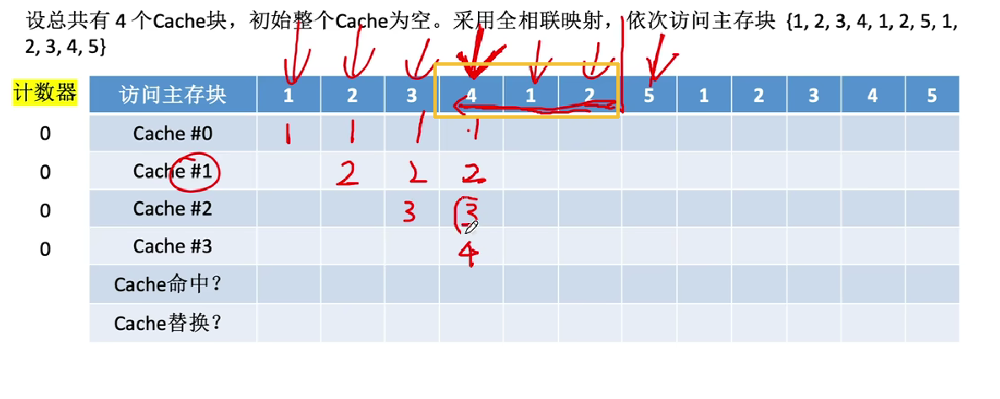
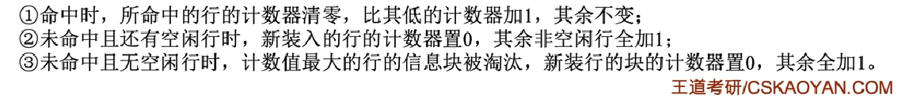
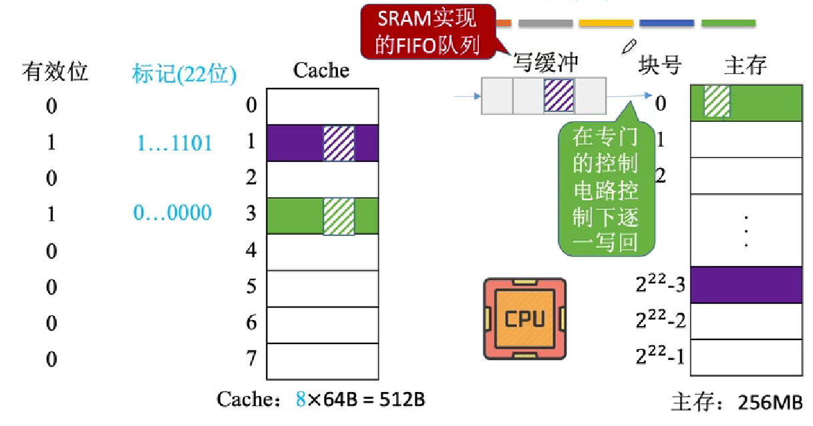
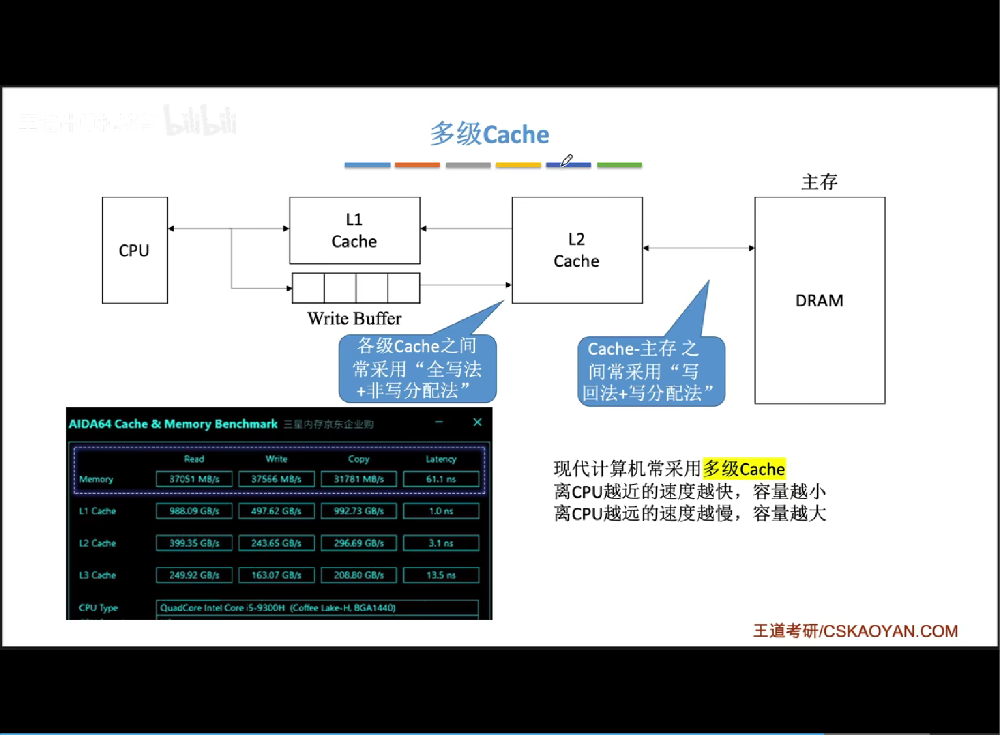

# 三种替换算法

直接映射方式直接根据Cache行数进行取余分配不需要置换操作，而全相连映射和组相联映射均需要进行替换操作。

常见的cache替换算法有：随机算法(RAND)、先进先出算法(FIFO)、最近最少使用算法(LRU)、最近不经常使用算法(LFD)四种。

## RAND FIFO

随机算法是在当Cache满时随机选中某个块进行替换的操作，先进先出算法是指每次进行替换操作时选择最早的那一块进行替换。

**抖动**

刚被换出的块又需要被访问即为抖动，而FIFO算法很容易出现上述问题，因为最先被访问的元素很可能还是会被使用到，例如CPU需要循环访问 ``{1, 2, 3, 4, 1, 2, 3, 4}`` 而当cache块仅为3时在调入4时，后续有需要重新访问1。因此并没有很好的考虑到局部性原理。

## LRU

LRU算法假设未来仍会访问最近访问过的数据，优先淘汰最长时间未被访问过的数据，故遵循了局部性原理。
为每一个Cache块增加了一个计数器，用来记录每个Cache块多久没被访问，越大表示越久没被访问过。当Cache块满时替换计算器最大的块， Cache块总数为2^n，则计数器位数需要n位。


做题时，可以通过回看的方式快速查找需要被替换的Cache块：回看三位，发现4，1，2均被访问过，则替换3(Cache #2)，调入5。



核心替换策略如下:



若被频繁访问到的主存块的数量大于Cache块的数量，也会发生抖动，例如访问 `{1, 2, 3, 4, 5, 1, 2, 3, 4, 5, 1, 2...}`。

## LFU

最不经常使用算法为每一个Cache块设置一个计数器，记录每个Cache块**被访问过几次**。当Cache满后替换“计数器”最小的块。

+ 新调入的块计数器=0，之后每被访问一次计数器+1。需要替换时，选择计数器最小的一行

+ 若有多个计数器最小的行，可按行号递增、或FIFO策略进行选择

LFU算法一曾经被经常访问的主存块在未来不一定会用到（如：微信视频聊天相关的块），并没有很好地遵循局部性原理，因此实际运行效果不如LRU。

# 算法实现

我们需要在 $O(1)$ 时间复杂度内完成两个操作：

+ 查询 (Get)： 查看 key 是否存在并返回其值。

+ 插入/更新 (Put)： 插入新数据或更新旧数据，并将其移动到“最近使用”的位置。

通过使用**双向链表维护访问顺序**，表头始终存放最近刚被访问的数据，表尾存放最久未被使用的数据，当缓存已满且需要替换时，则直接踢出表尾的数据，并依次右移。利用**哈希表记录数据位置**能够快速定位某个元素的位置，但没有双链表则无法知道谁是最近被访问的，谁该被淘汰（无序）。

```cpp
#include <iostream>
#include <unordered_map>
#include <list>

class LRUCache {
private:
    int capacity;

    // 存储键值对双链表
    std::list<std::pair<int, int>> cacheList;
    // 映射key到value位置的迭代器
    std::unordered_map<int, std::list<std::pair<int, int>>::iterator> cacheMap;
}
```


```cpp

public:
    // this->capacity = capacity;
    LRUCache(int cap): capacity(cap){}

    //get查询元素
    int get(int key) {
        if(cacheMap.find(key) == cacheMap.end()) {
            return -1; // 未找到
        }

        // 被访问节点需要移动到表头
        // 使用splice高效移动链表
        cacheList.solice(cacheList.begin(), cacheList, cacheMap[key]);
        return cacheMap[key] -> second; // 返回key节点的值
    }
```

```cpp
    // 插入/更新操作
    void put(int key, int new_value) {
        // key 已经存在，更新内容并移动到表头
        if(cacheMap.find(key) != cacheMap.end()) {
            cacheList.splice(cacheLsit.begin(), cacheList, cacheMap[key]);
            cacheMap[key] -> second = new_value;
            return;
        }

        // Cache满则删除表尾元素
        if(cacheList.size() == capcity) {
            // 获取到最后一个节点的key
            int lastkey = cacheList.back().first;
            cacheMap.erase(lastKey);
            cacheList.pop_back();
        }

        // 最新的节点的计数器为0 插入头部
        // 在表头插入新的节点
        cacheList.emplace_front(key, new_value);
        cacheMap[key] = cacheList.begin(); 
};
```

# Cache写策略

Cache的写策略是为了解决CPU写数据时，Cache与主存中数据一致性的问题。

## 写命中

+ 脏位：Cache中的某块数据是否被修改过

### 写回法

写回法（write-back)
当CPU对Cache写命中时，只修改Cache的内容，而不立即写入主
存，只有当此Cache块被替换时才写回主存
减少了访存次数，但存在数据不一致的隐患。

+ I/O 与 Cache 的数据一致性问题：尚未写回主存时可能会遇到DMA访存。

+ 多核、多处理器Cache一致性问题：多核处理器每一个核均有自己的Cache，当Core1更新了某个共享变量，而Core2未命中直接访存。


### 全写法

全写法（写直通法，write-through）
当CPU对Cache写命中时，必须把数据同时写入Cache
和主存，一般使用写缓冲（writebuffer）

+ 写缓冲：SRAM实现的FIFO队列，CPU先将全部的Cache修改块写入到写缓冲中，当CPU去干别的事时，控制电路
将写缓冲中的数据逐块重新写回主存。



增加了CPU对Cache的写操作速度，但若CPU的写操作频繁，Buffer会因写缓冲饱和而阻塞CPU，等待空闲。

## 写不命中

写分配法（write-allocate)
当CPU对Cache写不命中时，把主存中的块调入Cache，在Cache
中修改。通常搭配写回法使用。

非写分配法（not-write-allocate）搭配全写法使用。
当CPU对Cache写不命中时**直接将数据写入主存**，不调入Cache。




