## 函数插值

### 一维插值

通俗讲就是在一维数轴上，已知n+1个数据点x<sub>i</sub>处的函数值y<sub>i</sub>，去寻找这个点集的近似曲线的过程。

#### 数值计算方法

_具体细节请参考《数学建模算法与应用》第三版 p114页。_

**多项式插值**

+ 待定系数法
+ 拉格朗日插值法
+ 牛顿插值法

**龙格震荡**

上述多项式插值随着节点增多而引起的**函数边缘震荡加剧**的现象称为龙格震荡。

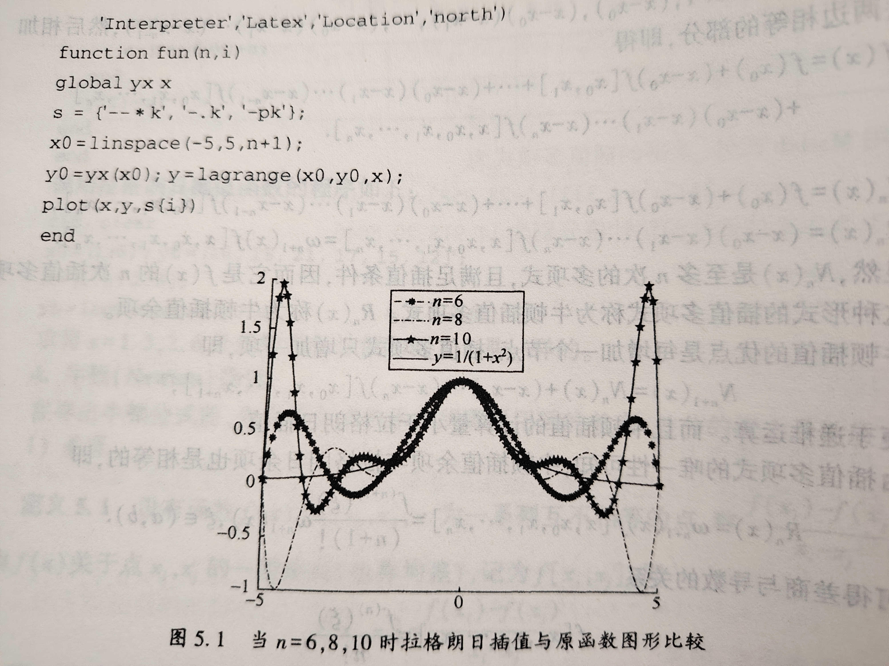

**分段插值**

龙格震荡问题产生的根本原因是：上述多项式方法**均是尝试使用单一高次多项式来拟合所有数据点**，导致剧烈震荡。

解决方法即使用**分段低次多项式**或**局部最优**的方式来构造对应曲线。

+ 分段线性插值

    当数据集足够多时，将整个插值区间分为若干个小区间，每个区间只使用2-3个点集，通过在每一个区间构造低次多项式（一次或二次函数）拟合每一个区间的曲线。
    
    当分段足够多时，误差更小，类似极限的思想，具体过程如下：

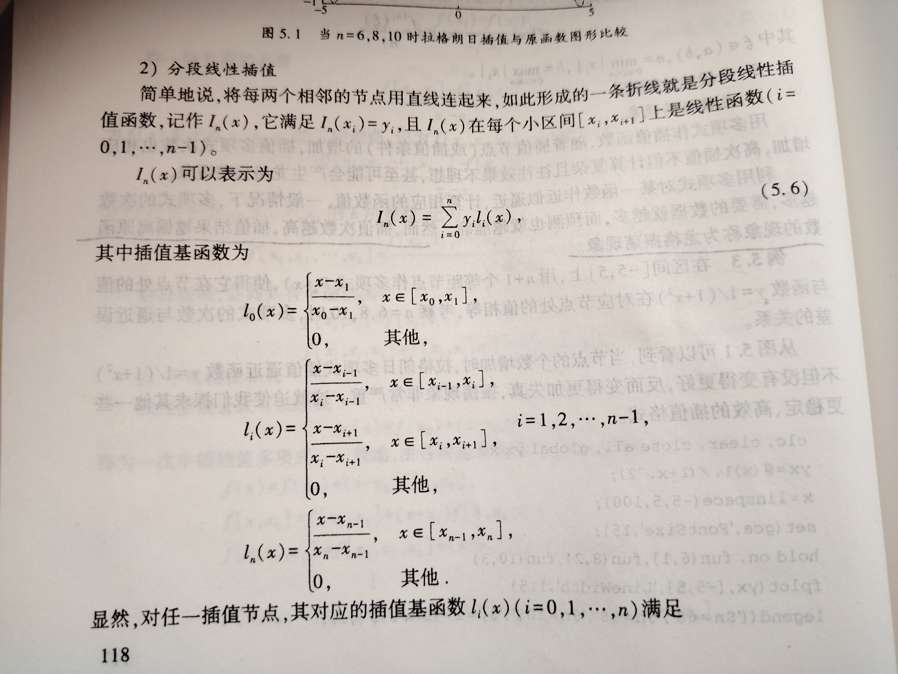

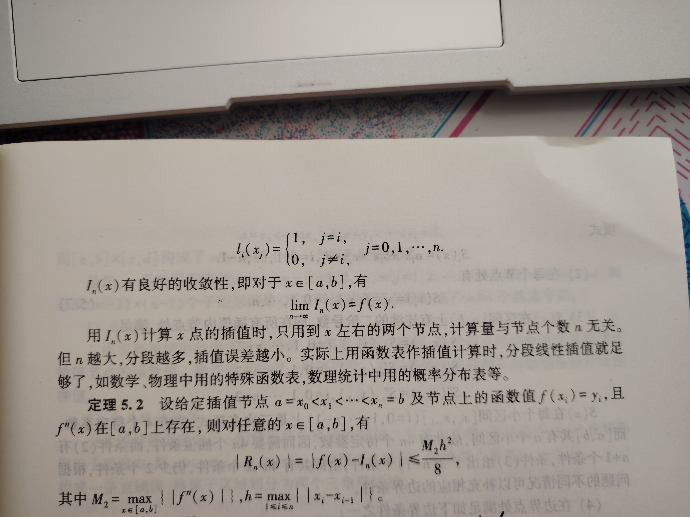

    注：缺点是：区间连接处不光滑，连接处的点集数据误差较大，实际表现则是存在不符合物理常识的“突变”。

+ 三次样条插值
    
    强制分段低次 + 光滑连接（三次多项式）
    
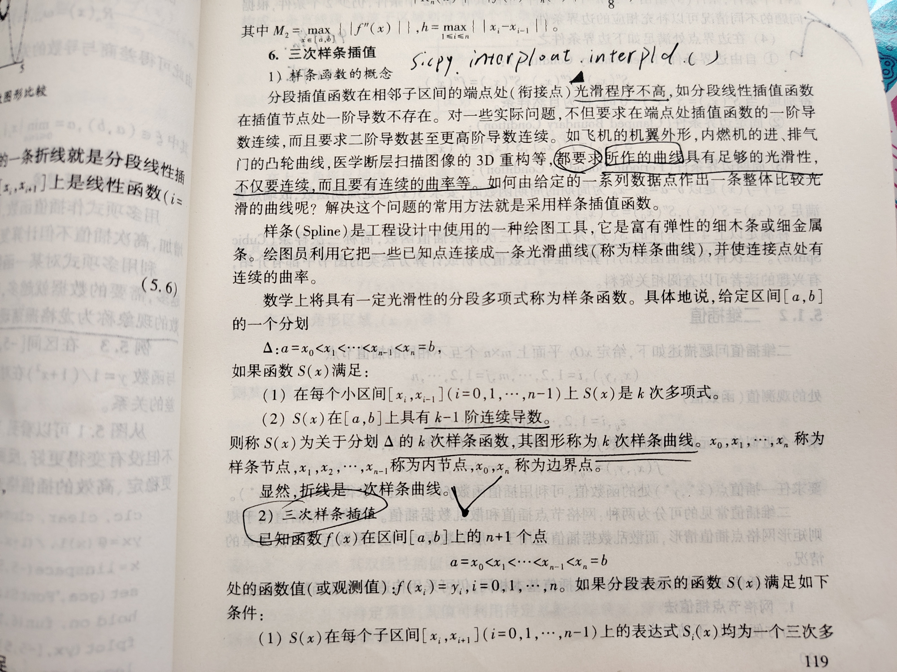
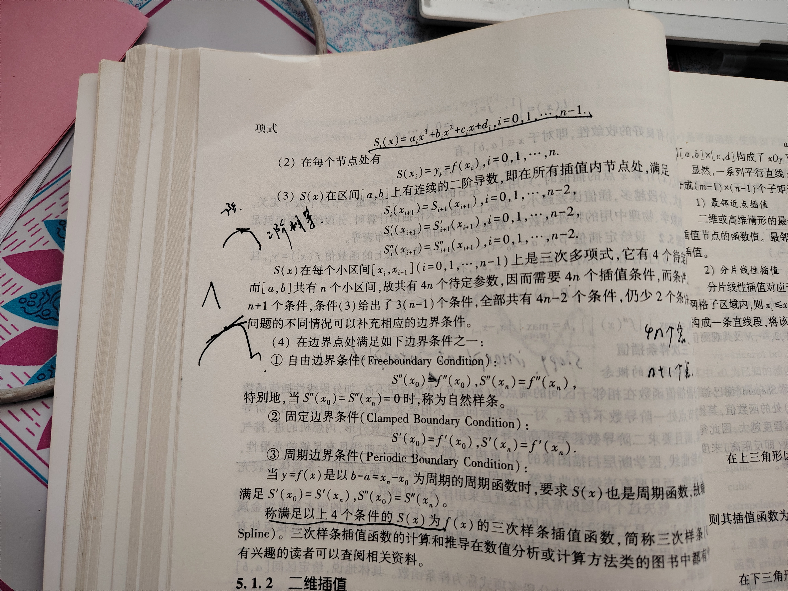

### 二维插值

二维插值的数据集给定在xOy平面上，通过求一个二元曲面函数建立数学模型。

详细过程见p121页。

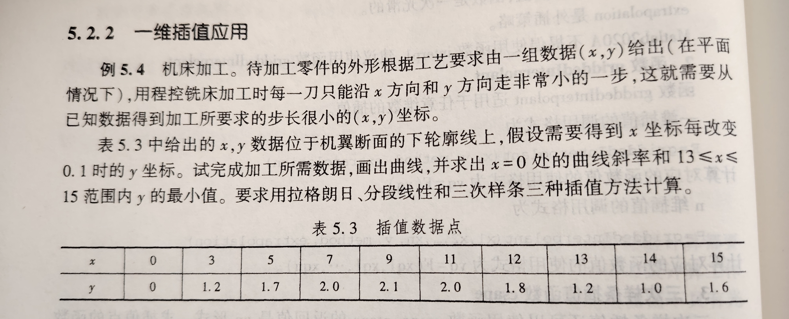

#### scipy实现

`scipy.interpolate`用于解决插值问题。

+ [官方文档](https://docs.scipy.org/doc/scipy/reference/generated/scipy.interpolate.lagrange.html)

+ [拉格朗日插值](https://docs.scipy.org/doc/scipy/reference/generated/scipy.interpolate.lagrange.html)

+ [分段线性插值](https://docs.scipy.org/doc/scipy/reference/generated/scipy.interpolate.interp1d.html#scipy.interpolate.interp1d)

+ [三次样条](https://docs.scipy.org/doc/scipy/reference/generated/scipy.interpolate.CubicSpline.html#scipy.interpolate.CubicSpline)

**使用说明**

```python
import numpy as np
from scipy.interpolate import lagrange

x: np.ndarray = np.array([0, 1, 2])
y: np.ndarray = np.array([1, 3, 2])

poly: np.poly1d = lagrange(x, y)

```
---

**实现**
```python
from scipy.interpolate import lagrange, interp1d, CubicSpline
import numpy as np
import matplotlib.pyplot as plt

x = np.array([0, 3, 5, 7, 9, 11, 12, 13, 14, 15])
y = np.array([0, 1.2, 1.7, 2.0, 2.1, 2.0, 1.8, 1.2, 1.0, 1.6])

#拉格朗日多项式 -> numpy.poly1d
lag_ploy = lagrange(x, y)

#生成待测x数组
x2test_arrry = np.arange(0, 15.1, 0.1)

#待测数组对应y值
y_lagrange = lag_ploy(x2test_arrry)

#拟合函数求导
derivative = np.polyder(lag_ploy)
#x=0处导数
der_of_0_lag = derivative(0)

#分段线性插值函数
interp1d_ploy = interp1d(x, y)
#y值
y_interp1d = interp1d_ploy(x2test_arrry)
#斜率
der_of_0_int = (y[1]-y[0] / (x[1]-x[0]))

#三次样条
cub_ploy = CubicSpline(x, y)

y_cubicSpline = cub_ploy(x2test_arrry)

#三次样条下0处导数
der_of_0_cub = cub_ploy.derivative(1)(0)

#第二问求最小值
mask = (x2test_arrry >= 13) & (x2test_arrry <= 15)
min_lagrange = np.min(y_lagrange[mask])
min_linear = np.min(y_interp1d[mask])
min_cub = np.min(y_cubicSpline[mask])

print("===斜率===")
print(f"拉格朗日插值在x=0处的斜率：{der_of_0_lag:.4f}")
print(f"分段线性插值在x=0处的斜率：{der_of_0_int:.4f}")
print(f"三次样条插值在x=0处的斜率：{der_of_0_cub:.4f}")

print("===最小值===")
print(f"拉格朗日插值：{min_lagrange:.4f}")
print(f"分段线性插值：{min_linear:.4f}")
print(f"三次样条插值：{min_cub:.4f}")

#绘图
fig, axes = plt.subplots(1, 3, figsize=(15, 5))
axes[0].plot(x2test_arrry, y_lagrange, label='lagrange')
axes[0].set_title('lagrange')
axes[0].set_xlabel('x')
axes[0].set_ylabel('y')
axes[0].legend()
axes[0].grid(True)

axes[1].plot(x2test_arrry, y_interp1d, label='linear')
axes[1].set_title('linear')
axes[1].set_xlabel('x')
axes[1].set_ylabel('y')
axes[1].legend()
axes[1].grid(True)

axes[2].plot(x2test_arrry, y_cubicSpline, label='cubicSpline')
axes[2].set_title('cubicSpline')
axes[2].set_xlabel('x')
axes[2].set_ylabel('y')
axes[2].legend()
axes[2].grid(True)

plt.tight_layout()
plt.show()
```

**结果**
```text
===斜率===
拉格朗日插值在x=0处的斜率：-55.2916
分段线性插值在x=0处的斜率：1.2000
三次样条插值在x=0处的斜率：0.5023
===最小值===
拉格朗日插值：0.9391
分段线性插值：1.0000
三次样条插值：0.9828
```
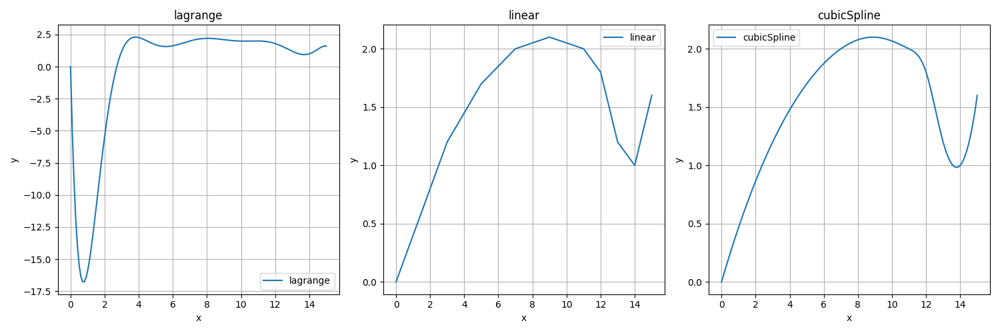

我简要简单探讨了数值方法的插值法，并基于`scipy.interpolate`进行了实现，使用matplotlib进行了可视化。

结果表明，拉格朗日插值法误差最大，同时Scipy官方也不推荐使用`lagrange`接口进行插值计算。

从图中也可知，分段线性插值的光滑性较差(x=14处)，**三次样条是进行插值的最优解**。

## 拟合问题求解

> 该部分对《数学建模算法与应用》第三版 拟合部分涉及的线性拟合和非线性拟合问题进行python求解。

## 线性方程组参数拟合

### 问题重述

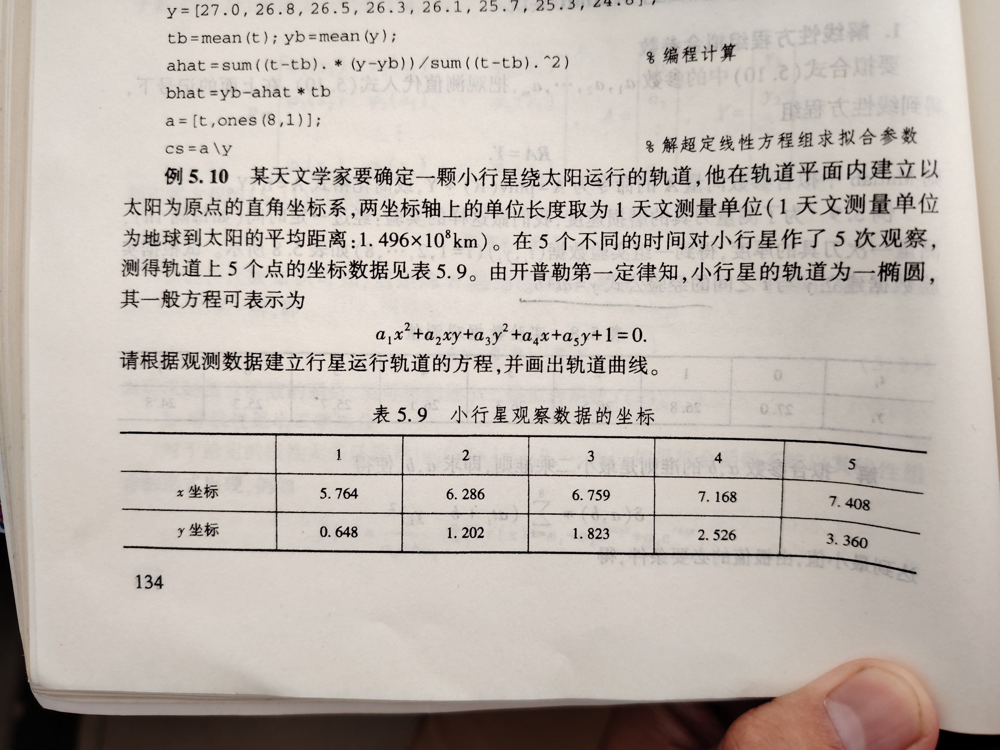

这道题需要使用高斯消元求解线性方程组的五个未知数的值，我们可以借助Numpy来实现系数矩阵的求解。

+ [numpy.linalg.solve](https://numpy.org/doc/stable/reference/generated/numpy.linalg.solve.html)：要求 **A 是方阵**（行数 = 列数），还必须满足**A 是满秩的**。
+ [numpy.linalg.lstsq](https://numpy.org/doc/stable/reference/generated/numpy.linalg.lstsq.html)：若方程不独立，则可以使用该接口实现最小二乘拟合得到**近似解**。

### python实现

```python withLineNumbers highlight=4-5,15,18,25-26
import numpy as np
import matplotlib.pyplot as plt

x = np.array([5.764, 6.286, 6.759, 7.168, 7.408])
y = np.array([0.648, 1.202, 1.823, 2.526, 3.360])

#系数矩阵
col1 = x**2
col2 = x*y
col3 = y**2
col4 = x
col5 = y

#np.column_stack将一维数组转拼成列矩阵
A = np.column_stack([col1, col2, col3, col4, col5])

#常数矩阵b = -1
b = -np.ones(len(x))

"""
最小二乘法求未知系数矩阵x
np.linalg.lstsq(A, b)
x:ndarray, residuals:ndarray 残差, rank:int 秩
"""
x, residuals, rank, _ = np.linalg.lstsq(A, b)
a1, a2, a3, a4, a5 = x

print(f"系数为{a1:.4f}, {a2:.4f}, {a3:.4f}, {a4:.4f}, {a5:.4f}")

#表达式
def _equation(x, y):
    return a1 * x**2 + a2 * x * y + a3 * y**2 + a4 * x + a5 * y + 1

#绘制椭圆图
x_grid = np.linspace(3.5, 8, 1000 )
y_grid = np.linspace(-1, 5, 1000)
X, Y = np.meshgrid(x_grid, y_grid)

Z = _equation(X, Y)

#绘图
plt.figure(figsize=(8, 6))
plt.contour(X, Y, Z, levels=0)

plt.xlabel('x')
plt.ylabel('y')

plt.show()
```
### 结果

```text
系数为0.0508, -0.0702, 0.0381, -0.4531, 0.2643
```
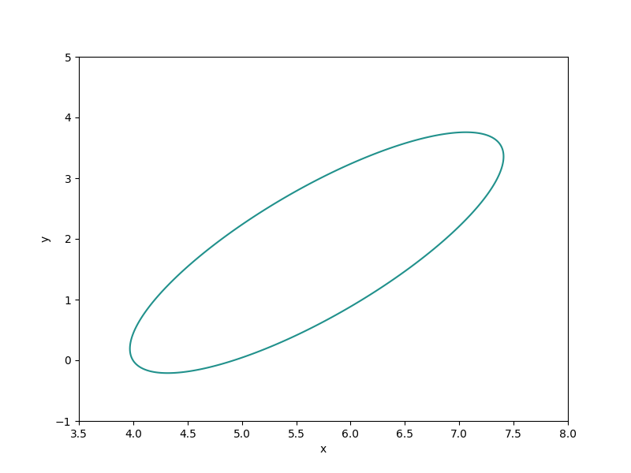


## 带约束的线性最小二乘拟合

### 问题重述

对观测数据 (x, y)，拟合函数 y = a * e^x + b * ln(x)，其中 a, b 是待求参数。约束条件：

1. a ≥ 0，b ≥ 0；
2. a + b ≤ 1。

观测数据（表 5.10）：

x = [3, 5, 6, 7, 4, 8, 5, 9]  
y = [4, 9, 5, 3, 8, 5, 8, 5]

### python实现

对于这一类带约束的最小二乘拟合，我们可以使用通用求解器 `scipy.optimize.minimize` 来求解。

```python withLineNumbers highlight=2,9-10,13-15,18,31

import numpy as np
from scipy.optimize import minimize

# 观测数据
x = np.array([3, 5, 6, 7, 4, 8, 5, 9])
y = np.array([4, 9, 5, 3, 8, 5, 8, 5])

# 拟合函数
def model(x, a, b):
    return a * np.exp(x) + b * np.log(x)

# 目标函数（最小化残差平方和）
def objective(params, x, y):
    a, b = params
    return np.sum((y - model(x, a, b)) ** 2)

# 初始参数估计
initial_guess = [0, 0]

# 变量边界约束 a >= 0, b >= 0
bounds = [(0, np.inf), (0, np.inf)]

# 额外约束 a + b <= 1
def constraint(params):
    a, b = params
    return 1 - (a + b)

constraints = [{'type': 'ineq', 'fun': constraint}]

# minimize 求解最小化问题（也用来实现规划问题）
result = minimize(objective, initial_guess, args=(x, y), bounds=bounds, constraints=constraints)

a, b = result.x
print(f"a = {a:.4f}, b = {b:.4f}")

```

### 结果

```text
a = 0.0005, b = 0.9995
```
## 非线性最小二乘拟合

### Q1 

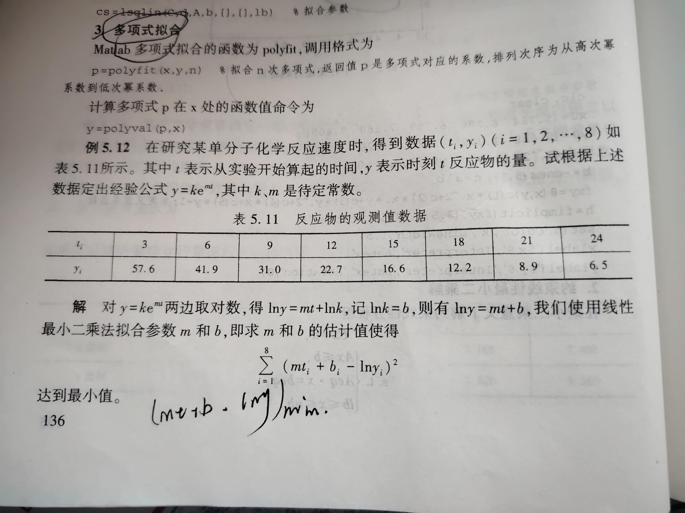

### 实现

对于某些非线性拟合，可以先进行数学运算：通过对两边取对数，**转化为线性**最小二乘使用 `np.linalg.lstsq` 进行拟合求解。

```python

import numpy as np

t = np.arange(3, 27, 3)
y = np.array([57.6, 41.9, 31.0, 22.7, 16.6, 12.2, 8.9, 6.5])

ln_y = np.log(y)

A = np.column_stack([t, np.ones_like(t)])

parmas, _, _, _ = np.linalg.lstsq(A, ln_y)

m, b = parmas
k = np.exp(b)

print(f"m = {m:.4f} \nb = {b:.4f} \nk = {k:.4f}")
```

### 结果

```text
m = -0.1037 
b = 4.3640 
k = 78.5700
```

### Q2

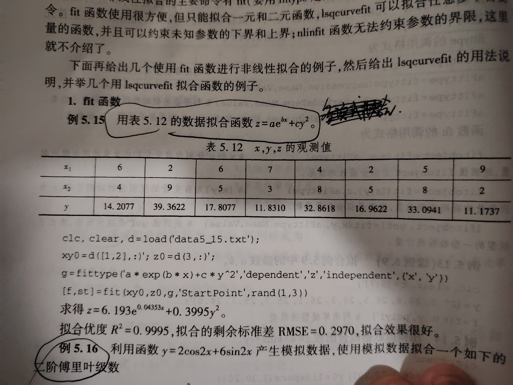

对于非线性拟合，我们也可以直接选用 `scipy.optimize.curve_fit` 进行求解，具体参数说明请查看[官方文档](https://docs.scipy.org/doc/scipy/reference/generated/scipy.optimize.curve_fit.html)。

#### python实现
```python withLineNumbers highlight=14
import numpy as np
from scipy.optimize import curve_fit

x = np.array([6, 2, 6, 7, 4, 2, 5, 9])
y = np.array([4, 9, 5, 3, 8, 5, 8, 2])
z = np.array([14.2077, 39.3622, 17.8077, 11.8310, 32.8618, 16.9622,  33.0941, 11.1737])

def _objective(parmas, a, b, c):
    x, y = parmas
    return a * np.exp(b * x) + c * y ** 2

parmas = (x, y)

popt, _ = curve_fit(_objective, parmas, z)
a, b, c = popt

print(f"a={a:.4f}\nb={b:.4f}\nc={c:.4f}")
```
#### 结果

```text
a=6.1929
b=0.0435
c=0.3995
```

### Q3

#### 问题重述
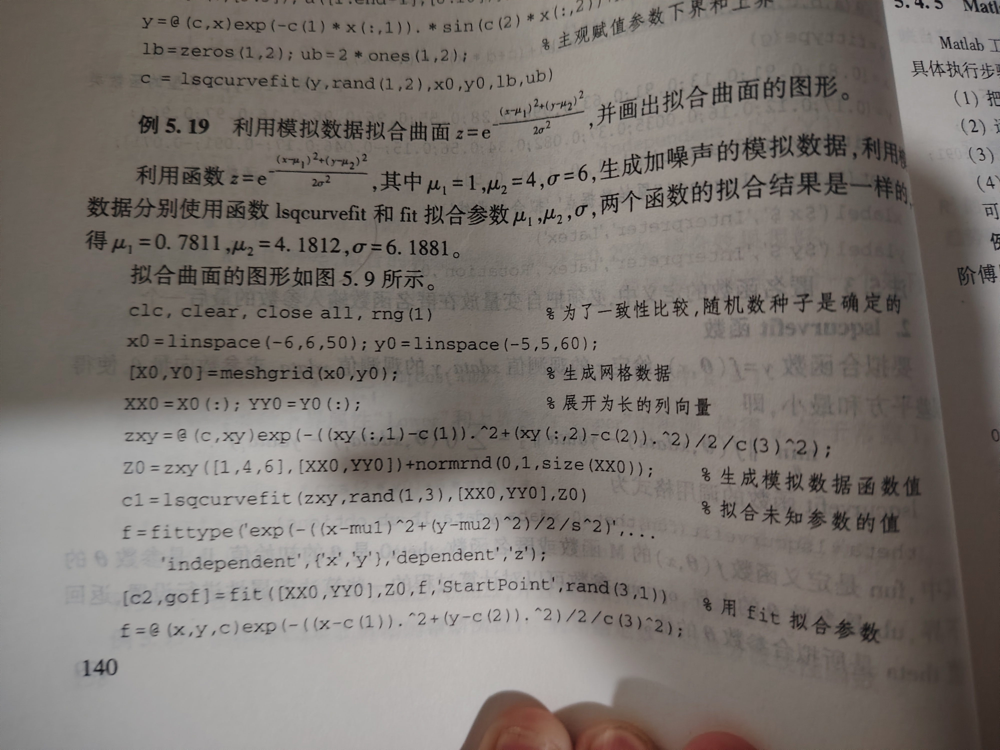

```python withLineNumbers highlight=7-8,11-12,18
import numpy as np
import matplotlib.pyplot as plt
from scipy.optimize import curve_fit

x = np.linspace(-5, 5, 50)
y = np.linspace(-5, 5, 50)
X, Y = np.meshgrid(x, y)  # 二维网格,所有组合
xy_flat = np.column_stack((X.ravel(), Y.ravel())) 

def _function(xy, u1, u2, u3):
    x = xy[:, 0]  # 提取所有样本的x
    y = xy[:, 1]
    return np.exp(-((x - u1) ** 2 + (y - u2) ** 2) / (2 * u3 ** 2))

z_real = _function(xy_flat, 1, 4, 6)

#加入噪声
z_noise = z_real + 0.05 * np.random.normal(size=z_real.shape)

predit = [0, 0, 1]

popt, _ = curve_fit(_function, xy_flat, z_noise, p0=predit)
u1, u2, u3 = popt

print("真实值：u1=1, u2=4, u3=6")
print(f"拟合数据：u1={u1:.4f}, u2={u2:.4f}, u3={u3:.4f}")
```

#### 绘图
```python
fig = plt.figure(figsize=(10,5))
ax1 = fig.add_subplot(121, projection='3d')
ax1.plot_surface(X, Y, z_real.reshape(X.shape), cmap='viridis')
ax1.set_title("orginal")  

ax2 = fig.add_subplot(122, projection='3d')
ax2.plot_surface(X, Y, _function(xy_flat, *popt).reshape(X.shape), cmap='viridis')  
ax2.set_title("optimize")
plt.show()
```

#### 结果

```text
真实值：u1=1, u2=4, u3=6
拟合数据：u1=1.0127, u2=3.9832, u3=5.9700
```
原函数曲面及拟合曲面图形：

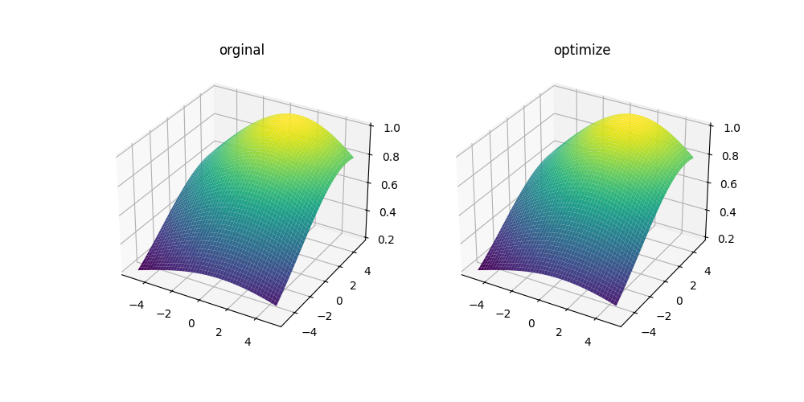


