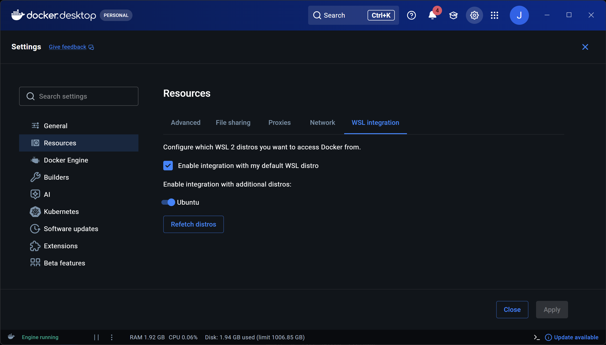

> 项目地址：[https://github.com/Laliet/CC-Switch-Web](https://github.com/Laliet/CC-Switch-Web)
> 

### 开启WSL Docker 集成

在 docker desktop/setting/Resources/WSL integration下集成指定Ubuntu虚拟机并保存退出



### 1. 环境准备

确保你的 WSL2 已安装 Docker 且当前用户已加入 docker 组。执行以下命令确立宿主机权限占位，防止 Docker 自动创建 root 权限目录。

```bash
# 创建配置持久化目录
mkdir -p ~/.cc-switch ~/.claude
```

### 2. 容器化部署

使用 `cc-switch-web` 镜像。注意：该镜像内部运行用户为 `ccswitch`，必须挂载至其对应的 `$HOME` 路径。

```bash
docker run -d \
  --name cc-switch-web \
  -p 3000:3000 \
  --restart always \
  -e ALLOW_HTTP_BASIC_OVER_HTTP=1 \
  -v ~/.cc-switch:/home/ccswitch/.cc-switch \
  -v ~/.claude:/home/ccswitch/.claude \
  ghcr.io/laliet/cc-switch-web:latest
```

### 3. 获取管理凭据

容器首次启动会生成随机高强度密码。由于文件权限默认为 `600`，需在宿主机侧提权读取。

```bash
# 提权并打印密码
sudo chmod 644 ~/.cc-switch/web_password
cat ~/.cc-switch/web_password
```

### 4. 接入 Provider 劫持

1. **访问控制台**：浏览器打开 `http://localhost:3000`（用户名：`admin`）。
2. **配置 API**：在 **Providers** 页面添加你的中转接口
3. **激活开关**：点击 **Enable**。
    - **原理**：此时容器会将劫持参数写入 `~/.claude/settings.json`。

### 5. 终端校验

回到 WSL 终端，验证 `claude-code` 是否已成功读取劫持配置。

```bash
cd ~
cd .calude
cat settings.json # 查看配置
```

---

### 常见故障排控

| **错误现象** | **根本原因** | **解决方案** |
| --- | --- | --- |
| `Permission denied` | 宿主机目录由 Docker 自动创建（Root 属主） | `sudo chown -R $USER:$USER ~/.cc-switch` |
| 挂载目录为空 | 挂载路径错误地指向了 `/root` | 重新运行并修正挂载点为 `/home/ccswitch/` |
| `claude` 无反应 | Node.js 版本过低或环境变量冲突 | `node -v` 确保 > 18，清理 `env` 中的 `CLAUDE` 相关变量 |