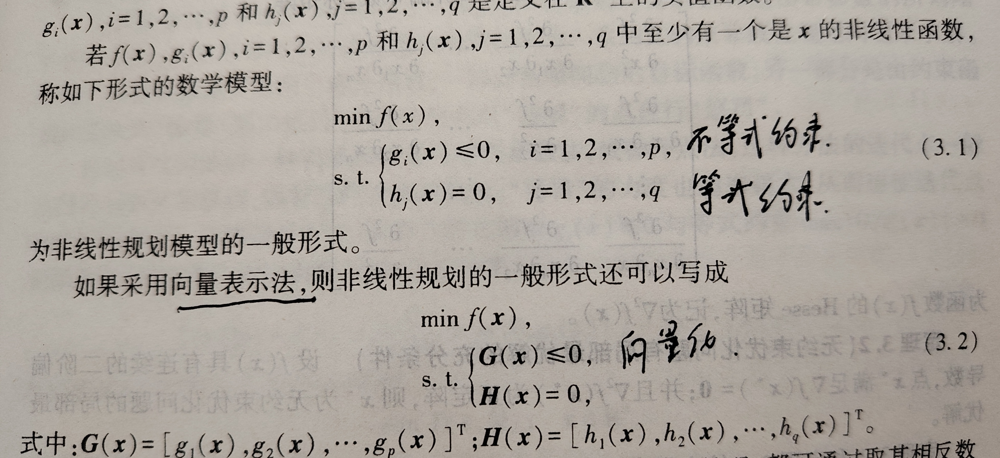
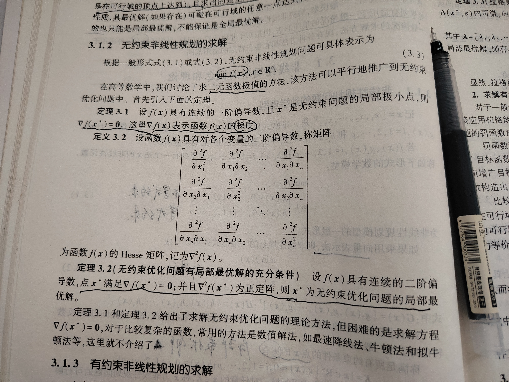
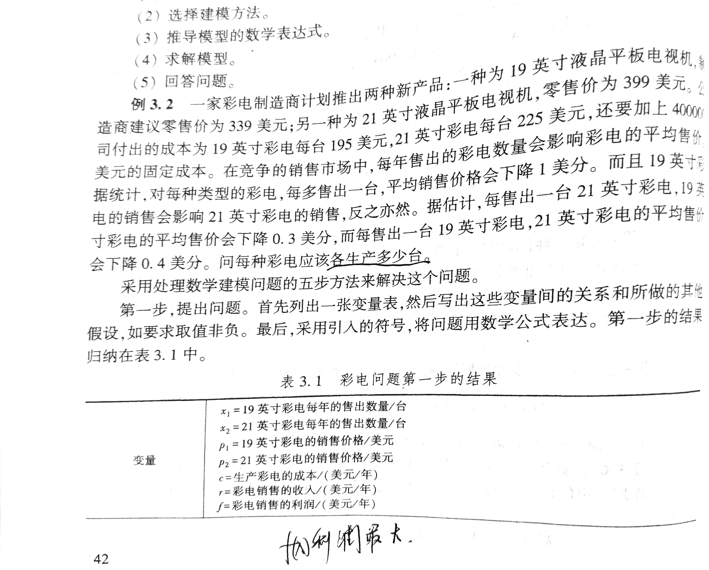
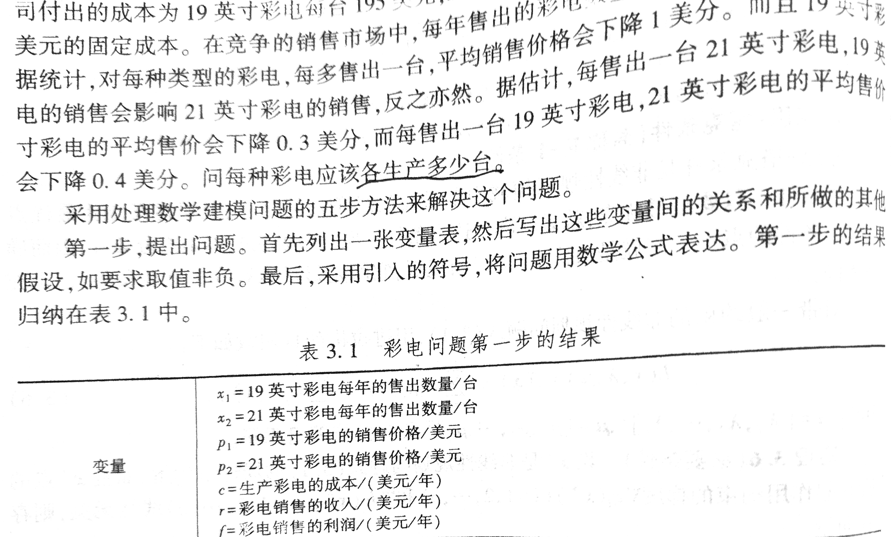
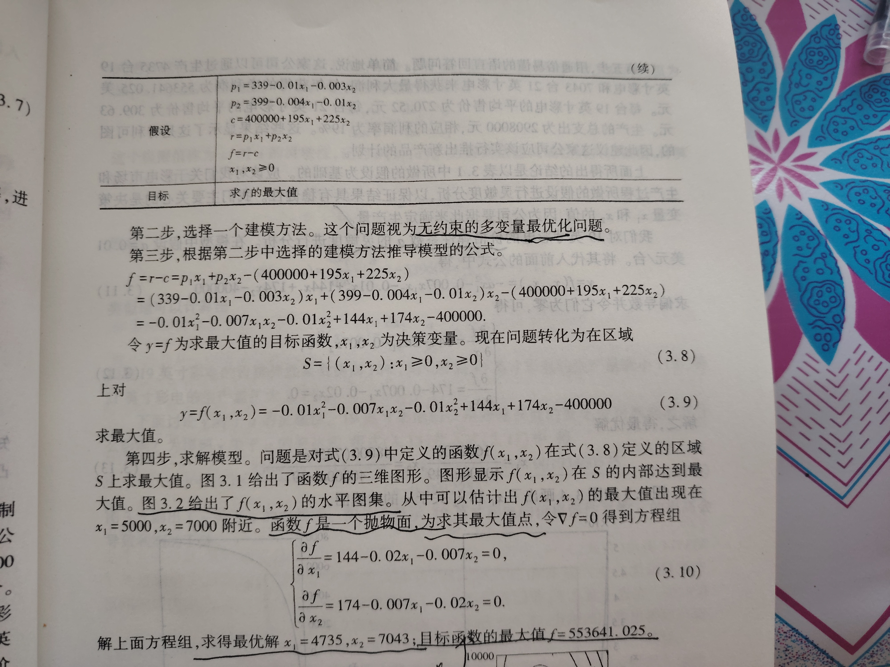

## 线性规划问题

某工厂生产 A、B 两种产品，需要使用甲、乙两种原材料。生产每件 A 产品需要消耗 2 单位甲材料和 3 单位乙材料，可获利 5 元；生产每件 B 产品需要消耗 4 单位甲材料和 2 单位乙材料，可获利 6 元。现在甲材料总量为 100 单位，乙材料总量为 90 单位。问：如何安排 A、B 两种产品的生产数量，才能使总利润最大？

### 建模与求解

+ 决策变量：生产A产品x件，B产品y件
+ 目标函数：max_z = 5x + 6y
+ 约束条件：
    + 2x + 4y \<= 100
    + 3x + 2y \<= 90
    + x >= 0, y >= 0

最小化目标函数的线性规划问题使用`scipy.optimize.linprog`库。

若求解目标函数的最大值，则`-max_z`。

```python
result = linprog(c, A_ub=None, b_ub=None, A_eq=None, b_eq=None, bounds=None, method='highs')
```
|参数名|含义|类型|
|:-----:|:-----:|:-----:|
|c|	目标函数的系数（必须有）|一维数组，如 [c1, c2, ..., cn]|
|A_ub|不等式约束（≤）左边的系数矩阵|二维数组，如 [[a11, a12], [a21, a22]]|
|b_ub|不等式约束（≤）右边的常数项|一维数组，如 [b1, b2]|
|A_eq|等式约束（=）左边的系数矩阵|二维数组，格式同 A_ub|
|b_eq|等式约束（=）右边的常数项|一维数组，格式同 b_ub|
|bounds|每个变量的取值范围（默认都是 (0, None)，即非负）|列表，如 [(x1_min, x1_max), (x2_min, x2_max)]|
|method|求解算法（highs）|字符串|


```python
import numpy as np
from scipy.optimize import linprog

#max_z
#求解最大值：max_z = -max_z_orgin
c = [-5, -6]

#不等式左边约束
A_ub = [
    [2, 4],
    [3, 2]
]

#不等式右边常数
b_ub = [100, 90]

#取值范围,列表
x_bounds = (0, None)
y_bounds = (0, None)
bounds = [x_bounds, y_bounds]

result = linprog(c, A_ub=A_ub, b_ub=b_ub, bounds=bounds, method='highs')

if result.success:
    print(f"最优解：x = {result.x[0]:.2f}, y = {result.x[1]:.2f}")
    print(f"最大利润：{ -result.fun:.2f}元") #结果取反得最大值
else:
    print("求解失败")
```

```text
最优解：x = 20.00, y = 15.00
最大利润：190.00元
```

## 非线性规划问题

Nonlinear Programming(NLP)指**约束函数和目标函数中至少包含一个非线性函数**。

非线性规划问题的一般模型形式如下，且可以写成向量化形式：



非线性规划问题的可行解分为**局部最优解**和**全局最优解**，需要通过算法进行区分。

> 线性规划的最优解一定是在可行域的边界上达到(特别是在可行域的顶点上达到)，且求出的是全局最优解。而非线性规划的最优解可能在可行域的任一点达到，且一般求出的是局部最优解。

无约束的非线性规划求解即二元函数极值的求法:



有约束的非线性规划求解请参考《数学建模算法与应用》第三版，p38页：

+ 只有等式约束非线性规划：使用**拉格朗日乘数法**转化为无约束非线性模型求解。

+ 等式约束和不等式约束问题：使用**罚函数法**转为无约束非线性模型求解（精度差）。

+ 凸规划和K-T条件（p39页）。

## 问题重述

题目来自原书p42页。


## 建模与求解

**问题：** 最大利润 `max_z` 

> 今天收获最大的就是这个建模思路。从变量到公式假设再到公式化简。数学建模的一般性思路，起点是对变量的清晰梳理。




求解非线性规划问题的通用python库是：`Scipy.optimize.minimize()`。

[官方文档](https://docs.scipy.org/doc/scipy/reference/generated/scipy.optimize.minimize.html)

[源码](https://github.com/scipy/scipy/blob/v1.16.1/scipy/optimize/_minimize.python#L54-L828)


```python
minimize(fun, x0, args=(), method=None, jac=None, hess=None,
             hessp=None, bounds=None, constraints=(), tol=None,
             callback=None, options=None)
```

**参数说明**

| 参数         | 类型        | 说明                                                                 |
|--------------|-------------|----------------------------------------------------------------------|
| fun          | callable    | 目标函数，即要求最小值的函数 f(x)                                   |
| x0           | array_like  | 初始猜测点（变量的起始值）                                          |
| method       | str         | 优化算法名称                 |
| jac          | bool/callable | 目标函数的一阶导数（梯度）；若为 True，表示 fun 返回梯度             |
| bounds       | sequence    | 变量的边界限制，如 `[(0, 1), (None, 2)]`                               |
| constraints  | dict/tuple/list | 约束条件，如 `{'type': 'eq', 'fun': lambda x: x[0] + x[1] - 1}`      |

**无约束规划**

```python
from scipy.optimize import minimize
import numpy as np
import time

#minize求非线性规划的最小值， 所以求-(-min_z)
def _objective(x):
    x_1, x_2 = x
    return 0.01*x_1**2 + 0.007*x_1*x_2 + 0.01*x_2**2 - 144*x_1 - 174 *x_2 +400000

#梯度函数加速收敛
def gradient(x):
    x_1, x_2 = x
    d_x1 = 0.02*x_1 + 0.007*x_2 - 144
    d_x2 = 0.007*x_1 + 0.02 * x_2 - 174
    return np.array([d_x1, d_x2])

x0 = np.array([5000, 7000])

use_gradient_start_time = time.time()

result = minimize(
    fun=_objective,
    x0=x0,
    method='BFGS', #BFGS 拟牛顿法，处理无约束优化问题最好
    jac=gradient,
    options={'disp': True}
)

use_gradient_end_time = time.time()
use_gradient_time = use_gradient_end_time - use_gradient_start_time

#不使用梯度函数
not_use_gradient_start_time = time.time()

result = minimize(
    fun=_objective,
    x0=x0,
    method='BFGS',
    jac=False,
    options={'disp': True}
)

not_use_gradient_end_time = time.time()
not_use_gradient_time = not_use_gradient_end_time - not_use_gradient_start_time

print("=======")
print(f"加速收敛后总时间:{use_gradient_time:.5f}")
print(f"最优销量：19英寸 = {result.x[0]:.0f} 台，21英寸 = {result.x[1]:.0f} 台")
print(f"最大利润：{ -result.fun:.2f} 美元")
print("=======")
print(f"不加速收敛总时间:{not_use_gradient_time:.5f}")
```

```text
Optimization terminated successfully.  -> 成功收敛到精度
         Current function value: -553641.025641 -> 取反后的最小值，-min_z
         Iterations: 8 -> 迭代次数 
         Function evaluations: 13
         Gradient evaluations: 13
Optimization terminated successfully.
         Current function value: -553641.025108
         Iterations: 8
         Function evaluations: 39 -> 标函数被计算次数
         Gradient evaluations: 13
=======
加速收敛后总时间:0.00200
最优销量：19英寸 = 4735 台，21英寸 = 7043 台
最大利润：553641.03 美元
=======
不加速收敛总时间:0.00251
```


