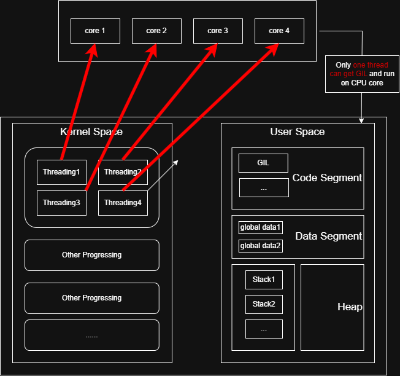
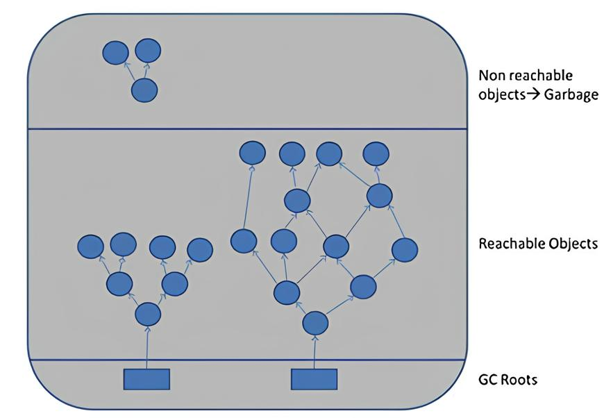
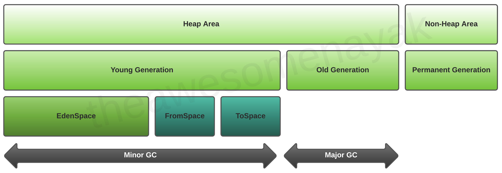

## 初始化

Cpython进程启动时会进行单例初始化，首先通过_PyRuntimeState初始化全局运行时状态，包括内存分配器、小整数对象池和GIL全局锁等。这一步骤在
_PyRuntime_Initialize()
函数中完成，确保所有解释器共享的资源就绪完毕。

接着系统初始化主解释器状态(PyInterpreterState)，这是python代码执行的核心环境。在这一阶段，会初始化垃圾回收程序(GC)、导入系统和内置模块。
当执行具体的python文件时，Cpython会先根据代码构建抽象语法树，并生成 `.pyc` 字节码文件，这是一种类似汇编代码的语法文件，并非机器可执行的二进制文件。

编译完成后，进入解释执行循环，python虚拟机(PVM)开始解释执行字节码。此时，系统会创建一个PyThreadState对象来管理当前线程的执行状态，包括调用栈、异常信息等。对于单文件执行，默认只有一个主线程，当然我们可以手动开启新线程(因为GIL锁的存在实际上对于计算密集型任务来说效果没那么明显)。

## 内存分配

不妨先试着观察一下 `a = 10` 和一个字符串变量在内存中占多大：

```python
import sys

a = 10
b = "李忠鹏"

print(type(a)) # <class 'int'>
print(sys.getsizeof(a)) # 14 bytes

print(type(b)) # <class 'str'>
print(sys.getsizeof(b)) # 44 bytes
```
从结果可以看出，Cpython为一个整数分配了14个字节的内存。这似乎很违背直觉，毕竟在我们的印象里，整数似乎也才只占4个字节的样子。实际上，a变量指向的是一个PyObject对象，这个对象包含数据本身，数据类型，引用计数器等其他附加维护参数。

在C/C++中，动态分配在堆上的内存需要手动释放，而类似python、Java等语言的"动态性"就没有要求过这个一点，也就是说堆内存的回收与释放交给了解释器完成，代价就是堆上每一个变量占的内存增加了(需要维护一个计数器在必要时回收这个变量，防止内存泄露)。

回到变量本身，python中一切类型皆对象，这说的是变量的类型在内存中的状态：基于 `PyObject` 结构体的对象类型。所有内置类型（如 int、str、list）和自定义对象都必须包含这个结构体作为其第一个成员。而当我们定义了一个类似 `a = 1` 的变量时，实际上 `a` 所指向的是一个对象，而不是1本身。下面的代码展示了Cpython是如何定义PyObject和PyLongObject的：

```C
// Include/object.h
// 开启GIL锁的PyObject结构体
#ifdef _Py_OPAQUE_PYOBJECT
  /* PyObject is opaque */
#elif !defined(Py_GIL_DISABLED)
struct _object {
    _Py_ANONYMOUS union {
#if SIZEOF_VOID_P > 4 // 64位
        PY_INT64_T ob_refcnt_full; /* This field is needed for efficient initialization with Clang on ARM */
        struct {
#  if PY_BIG_ENDIAN
            uint16_t ob_flags;
            uint16_t ob_overflow;
            uint32_t ob_refcnt;
#  else 
            uint32_t ob_refcnt; // 引用计数器
            uint16_t ob_overflow; // 计数溢出标记
            uint16_t ob_flags; // 标志是否被GC回收
#  endif
        };
#else // 32位
        Py_ssize_t ob_refcnt;
#endif
        _Py_ALIGNED_DEF(_PyObject_MIN_ALIGNMENT, char) _aligner;
    };

    PyTypeObject *ob_type;
};
```

```C
// PyLongObject整数对象
typedef struct _PyLongValue {
    uintptr_t lv_tag; /* Number of digits, sign and flags */
    digit ob_digit[1];
} _PyLongValue;

struct _longobject {
    PyObject_HEAD // 宏展开为PyObject ob_base
    _PyLongValue long_value;  // 值
};
```

### 变量缓存

为减小内存创建开销，在解释器启动时，会提前创建并缓存-5-256内所有的整数对象，这些对象在程序运行时不会被销毁，当执行例如 `a = 1`, `b = 1`这样的重复赋值时，实际上都指向的是初始化时预分配的同一个对象。

```python
a = 1
b = 1

# is用于判断两个栈变量是否是否指向同一个堆地址
print (a is b)  # True

# id函数也可以用来获取所指对象的地址
print(id(a) == id(b)) # True
```

实际上，python优化了更多，即使不属于(-5, 256)中的整数，当我们重复创建同一个对象的时候，他们实际内存地址也是一样的：
```python
import dis

code = """
c = 2577
d = 2577
print(c is d)
print(id(c), id(d))
"""

dis.dis(code)
```

```shell
  2           0 LOAD_CONST               0 (2577)
              2 STORE_NAME               0 (c)

  3           4 LOAD_CONST               0 (2577)
              6 STORE_NAME               1 (d)

```

使用 `dis.dis()` 对上述两个变量进行反汇编后可以看出，两条赋值语句均为 `LOAD_CONST 0 (2577)`，他们在常量池索引中都为0，对应同一块地址，也就是同一个对象。 


## GIL全局锁

前面提到，Cpython对内存的管理依赖 `ob_refcnt` 计数器。而多线程下的线程安全问题也因此而来。比如，我们同时开启两个线程对全局变量 `global a` 进行一些操作，假设现在变量a的ob_refcnt值为2，当这两个线程线在两个核上运行时就有概率出现以下的情形：
Thread1读取a的ob_refcnt = 2，Thread2也执行这一步，读取到ob_refcnt的值如果也为2。那么后面可能就会出现变量a的计数出错的问题，这就会导致程序提前中断或出现不可预测的未知错误。

实际上，python的第一个0.9.0版本发布时，那时并没有多核的概念。而GIL的诞生也同样是为了解决对象计数器线程安全的问题，因为字节码的操作并不是原子性的，而在单核CPU上线程之间的切换过程也会遇到在多核CPU下同样的问题。而Guido设计的这个粗粒度的线程锁就保证了这个问题不会发生。

关于在解释器层面设计一个粗粒度的锁的好处是什么以及为什么不移除GIL，Guido本人在[这篇Blog](https://www.artima.com/weblogs/viewpost.jsp?thread=214235&utm_source=chatgpt.com)中已经回答。

```C
// python/ceval_gil.c

// 获得锁
#endif
    /* We now hold the GIL */
    _Py_atomic_store_int_relaxed(&gil->locked, 1);
    _Py_ANNOTATE_RWLOCK_ACQUIRED(&gil->locked, /*is_write=*/1);

    if (tstate != (PyThreadState*)_Py_atomic_load_ptr_relaxed(&gil->last_holder)) {
        _Py_atomic_store_ptr_relaxed(&gil->last_holder, tstate);
        ++gil->switch_number;
    }

// 锁被占有，请求释放锁
    _Py_set_eval_breaker_bit(holder_tstate, _PY_GIL_DROP_REQUEST_BIT);
    drop_requested = 1;
```

在四核CPU下，当我们开启四个线程时，实际上，最后程序的运行时间和在单核下时间是一样的，并不是1/4。即使在某个时刻内核确实将四个线程分配到了到四个CPU上，但因为GIL是一个解释器级别的锁，所以没有拿到锁的线程只能干等，具体过程可以参考我下面绘制的这张示意图:)



```python
import threading
import time

def count_task(n):
    result = 0
    for i in range(n):
        result += i
    return result

# 单线程执行
def single_thread(n):
    start = time.time()
    count_task(n)
    end = time.time()
    return end - start

# 多线程执行（4个线程）
def multi_thread(n):
    threads = []
    task_per_thread = n // 4
    start = time.time()
    
    for _ in range(4):
        t = threading.Thread(target=count_task, args=(task_per_thread,))
        threads.append(t)
        t.start()
    
    # 等待所有线程完成
    for t in threads:
        t.join()
    
    end = time.time()
    return end - start

if __name__ == "__main__":
    total_iterations = 10**8
    
    single_time = single_thread(total_iterations)
    print(f"单线程耗时：{single_time:.2f}秒") # 单线程耗时：6.43秒

    multi_time = multi_thread(total_iterations)
    print(f"4线程耗时：{multi_time:.2f}秒") # 4线程耗时：6.75秒
```
从这个程序中也可以看出，对于计算密集型任务来说，多线程和单线程耗时几乎是一样的。换句话说，同一个时刻只运行了一个线程。
## GC

### 引用计数器

python的垃圾回收采用引用计数为主，分代回收为辅的策略，用来实现堆内存中对象的自动回收与释放。在创建一个对象时，该对象的 `ob_refcnt` 初始化为1，每被引用1次，计数加一。相反，引用的次数减少一次，就减1。若减到0则自动销毁并释放该对象。被引用其实就是该对象被"调用"、被"使用"的意思，比如 `a = 10`， 10这个对象就被使用了一次，计数加1，再比如 `b = a`，10这个对象又被使用了一次，计数再次加1。只要抓住计数器加1针对的是变量本身这个问题其实很好理解。
那么，自然而然地，当一个变量的 `ob_refcnt == 0` 时，也就意味着不再被使用，可以释放。 

而引用计数无法解决的一类问题是循环引用的情况，这会导致内存在程序运行的生命周期中一直未收回，导致内存泄露：

```python
import sys
import gc

gc.disable() # 禁用GC，只依赖计数器

a = [1, 2, 3]
b = [4, 5, 6]

print(sys.getrefcount(a) - 1) # 1
print(sys.getrefcount(b) - 1) # 1

a.append(b)
b.append(a)

print(sys.getrefcount(a) - 1) # 2
print(sys.getrefcount(b) - 1) # 2

"""
此时执行del a del b，但是计数结果仍不为0，实际上未收回
"""
del a # 1 
del b # 1

```

### 标记-清除

上文提到，计数器无法处理容器类变量循环引用的情况，而垃圾回收机制就是为了解决这一问题而配套出现的，主要包括两部分：标记-清除和分代回收。

Cpython单独维护了容器类对象的循环双向链表，引用计数加1的操作仍和计数器的实现一致，而回收算法则将整个栈变量及其对堆上的对象的引用构成一个有向图，解释器通过周期性地从 `GC Roots` 对象作为出发点，遍历整个有向图，被遍历到的节点即可达(reachable)，即被真正引用，而孤立节点即不可达，需要被销毁并释放。



### 分代回收

由于标记-清除算法需要遍历所有被跟踪的对象，那么可以想象，在那些构造了成百上千个容器对象的程序中，垃圾回收的过程就变得极其耗时了。分代回收策略主要就是为了优化性能而出现的。这一算法主要基于这一事实：新对象更可能被回收，而每一次存活下来的老对象更可能继续存活。说白了就是"区别对待"，新的对象检查频繁一些，而那些存活的旧的就放缓检查时间，因为他们在直觉上会存活的更久。

具体来说，分代计数将所有容器对象拆成了三个链表——0代，1代，2代。每一代都维护一个独立的循环双向链表，初始化时则所有对象均属于0代，每一次执行标记-清除算法后，存活下来则意味着他们可能会存活的更久，则晋升到下一代，降低检索时间。

规则具体如下：

| 维度         | 第0代                | 第1代          | 第2代                |
|--------------|-------------------------------|-------------------------------|-------------------------------|
| 触发阈值 | 新增对象≥700个                | 触发10次第0代回收后            | 触发10次第1代回收后            |
| 回收频率     | 最高                          | 中等                          | 最低                          |
| 存活对象处理 | 晋升至第1代                    | 晋升至第2代                    | 保留在第2代                    |
| 核心目的     | 快速回收短期垃圾              | 平衡效率与开销                | 减少对长期对象的无效扫描        |



## 结语

最近在学习操作系统课程，被其中很多概念困扰，突然想到我好像还从来没有系统性了解一下编程语言的内存实现与运行机制，尤其是垃圾回收这个名词一直让我很困惑。索性结合Cpython学习一下。初看Cpython的代码，被数目庞大到不知从哪看起的.h文件深深震撼，更让我感慨的是这些伟大的作品居然无偿开源了出来。学也无涯！不断学习！
