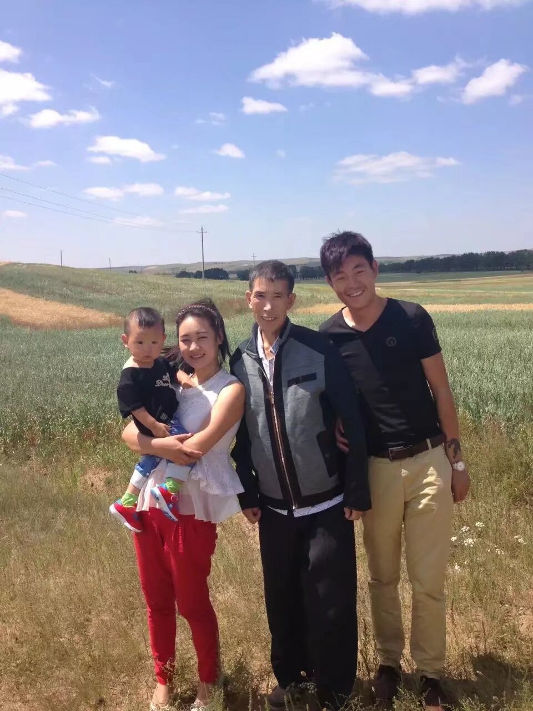

小李来自北河省的一个普通的不能再普通的农村家庭。原本，他可能和其他北河省的孩子一样，平平淡淡的上初中，高中，上大学，有一个不错的工作，结婚，生子。他的父亲和他说，上了初中一定要给他买一辆山地自行车，因为毕竟也不能每天走着去上课。
他的父亲也是这样做的，为了家里的一切，为了孩子的一切去干最重的活，每天6点天还没亮就从家走了，直到晚上八九点才能回来。

可是最后，没等小李初中毕业，父亲却早已罹患癌症，不辞而别。

_我时常在想，为什么命运如此的不公，不能平等对待每一个人，就连最基本的活着，对于普通的家庭来说，都是如此的奢侈。_

小李变得郁郁寡欢，他逐渐意识到，他的父亲竟是被这个家庭累死的，是这个社会，这个家庭亲手杀死了自己的父亲。

他记得，有一次亲戚请客去吃自助餐，父亲开玩笑的说，让小李带一个猪肘子回来，可是，终究父亲也没等到这个猪肘子。他又想到很多，他想到原来自己是这么的不懂事，亏欠父亲太多太多了，可是当他尝试与父亲共处时的点点滴滴时，却又什么都没记住...
他这才意识到，他亏欠父亲太多太多了，只有努力学习了，其他的没别的办法了。

再后来，家里的重担全放在了母亲一个人的身上。逐渐地，他发现，母亲竟也像父亲一样了，一样变得消瘦。小李高考时，母亲从老家赶回来，是下午，考完某一门科目，从校门出来，她的母亲看到了他，他没看到他的母亲，他也不知道母亲来了，母亲激动地喊了他的名字，小李看到母亲高兴的跳了起来，
小小的身体，脸已经被老家的太阳晒得很黑，完全没了原先那几年的光泽。后来他才意识到，母亲也老了。

可是，终究，他也只是一个普通人，即使他再怎么努力，再怎么刻苦，终究，智力的客观因素就是存在的，他只考上了一个省内普通不能再普通的本科，学了他喜欢的计算机专业。可是，他至今仍忘不了，分数出来的那个晚上，母亲的神态是什么样的，当有人说“xxx考了540分”之后，母亲脸上没有笑容，除了尴尬还是尴尬。或许，她太爱这个孩子了，她也最不了解她的孩子了，
她指望他可以考一个“很好”的大学。嗯，亏欠的太多了。

可是，小李呢，他怎么办？面对残缺的家庭，面对家庭现实的经济压力，面对前途的迷茫，还有各种瞧不起。

我想或许，只有不停的追逐才更有意义吧，把这份沉甸甸的思念和深厚的寄托始终记在心里就好了，使劲的学，不停的学，干自己觉得对的事情就好。

如果我的父亲还活着该多好，就那么平平淡淡的该多好，，能给我买那辆从未买过的自行车该多好，能知道我上的哪所大学该多好，要是我奶奶还或者该多好。草泥马的老天爷，为什么这么不公平。

