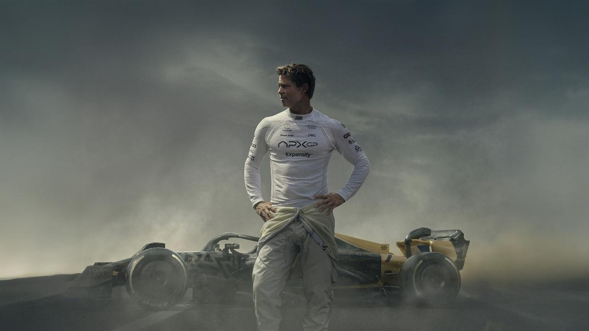

## 博客本身

中午吃饭，看到朋友圈的人发还有12个小时就2026年了，突然想想，时间过的真快，半年仿佛就在一眨眼。
从写下 [过半的大学生活](https://2jone.top/half-of-my-college-life)这篇文章到现在，时间上已悄然过去半年。时间对我来说真的感觉变快了，越来越不经过了，有时候迷迷瞪瞪一会，可能半天就过去了。
可是这半年做了什么，又学了哪些新东西呢？在这里做一个总结。

最值得提到的肯定是这个博客的完整搭建。从一点点摸索，到现在基本上完整运行。我终于找到了一种能让自己静下来、沉浸到自己感兴趣的东西的一种方式 —— 写博客。
从今年年中开始，陆陆续续开始记录，开始写自己对某一项感兴趣的知识点的探索，这是我目前最为满意的一件事情。但是最美中不足的可能就是本博客是基于国外老哥的开源二创，站在了巨人的肩膀上了。奈何正在备战考研，各种琐事，一直没有时间进行完整自己重构，这个工程希望可以在考上研究生后进行，很是期待。

第一篇博客写给我的父亲，永远都无法释怀、永远都放不下的遗憾，祝愿您在那边保重。

## 写代码的热情

第二件事就是给张寰臻老师写的一个 [软件](https://github.com/lavanceeee/Laser-Fresnel-Reflection-Simulation-Qt)，虽然项目很小，但是作为一个可以稳定运行的初具完整结构的项目来说，还是很满意的。相较来说这个 [OpenCV项目](https://github.com/lavanceeee/Michelson-Fringe-Counting-Qt)真是没法看了，考完研后会全力将这个项目存在的已知问题进行全面重构和修复。要说这个项目给我最大的收获，可能就是Qt这种系统级别的框架真的不适合用来做复杂页面，而是尽可能的关注功能和性能本身会比既要性能又要好看的UI这种想法实在的多，因为实际上也没人在意一些有的没的的UI，而更要好好打磨功能。

当然，我这里想说的UI并不是指用户界面多么现代化，更准确的来说是指代用户体验UX，比如我最初的想法是在Qt中实时显示图像画面和处理过程，以为是很理所当然很容易实现的事情，可是这个想法还是太天真了，因为OpenCV要处理的图像矩阵是巨大的，而这巨大的开销在时间上的累积是无法想象的， 这就导致了这个软件最大的一个灾难级别的Bug就是卡顿和内存溢出，随着时间的推移，由于内存释放不合理，卡顿就会越来越严重。当然这是可以解决的，但是对于时间有限的比赛来说，这样灾难级别的功能还是不要添加为好，而且更为致命的是，着很大程度上消耗热情，浪费精力，在无数的试错之后血本无归，对项目本身来说很不值得。

## 27考研

不知为何，我似乎总是比别人慢半拍，我很难在对的时刻去认认真真做好每一件该做的事，总是事后豁然大悟，追忆-如果我当时xxx该有多好。我也终于明白“把握机会”到底是什么意思——有时候，有些事，根本就不需要准备，硬着头皮上就行了。先有个经验，管他那么多。可是，大学过半，还哪有那么多机会呢，浪费的时间就真浪费了，我还能抓住什么呢？可能就只剩下考研了。不过，很幸运的是，我能沉浸在考研这个过程中，我很好的复习了数据结构，C/C++写一些简单算法的能力得到了很大的提高，以前总是十分害怕leetcode以及和算法有关的一切东西，但是我逐渐沉浸在了这个过程中，也很好。
其次就是操作系统和计算机网络。我终于大体明白了网络到底TMD是怎么工作的了！这个问题可以说困扰了我足足有两到三年了，一直很好奇。问AI也没有很深刻的解答，终于还是在课本的学习中得到了很好的解答。

## 电影

## 苹果的审美依旧在线

说到电影，今年觉得最值得看的可能莫过于《F1：狂飙飞车》了，五颗星都不够。配乐和镜头都是那么的恰到好处，每一帧都很符合我的期待，很难用喜欢去形容一部电影，但是这部电影是这样的。这部电影我至今都还记得，是我熬夜一口气看完的，我记得是两个多小时。可是一点都不累，非常的过瘾！再者就是F1本身，在看这部电影之前，光闻其名，但并未真正了解过，这部剧可以说给我了一个很好的第一映像的悬念，非常喜欢。

### 杜Sir，Respect!

还有值得一提的可能就是杜琪峰，杜Sir的电影看了《枪火》，《机动部队》，《黑社会》，《黑社会2》，《放逐》。但是最喜欢的还是《枪火》和《机动部队》。这两部电影也把我拿捏死了，尤其是《机动部队》很符合我的胃口，说不上理解的多么深刻，但是那种平静叙事中带有的强烈刺激感给我留下了很深的映像。其次就是杜Sir很具有个人风格的拍摄手法也很符合我的口味，但是在《黑社会》、《放逐》等电影中就逐渐看不到了，或者说没有那么强烈了。

在Youtube看了关于杜Sir的一些采访，确实他的说话风格、言谈也符合电影中想表达的一些内容。很一致、很真实、坚持自我。Respect.

