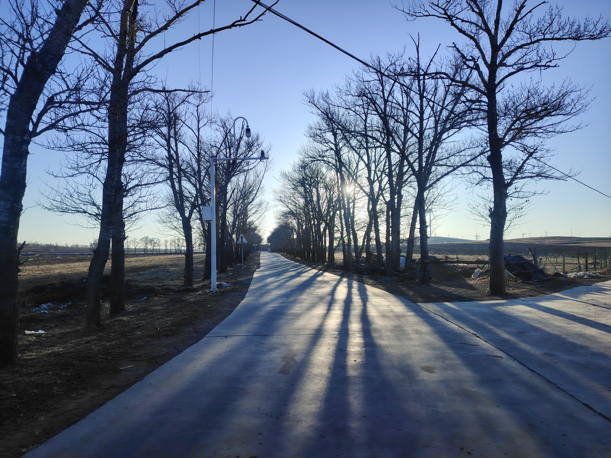
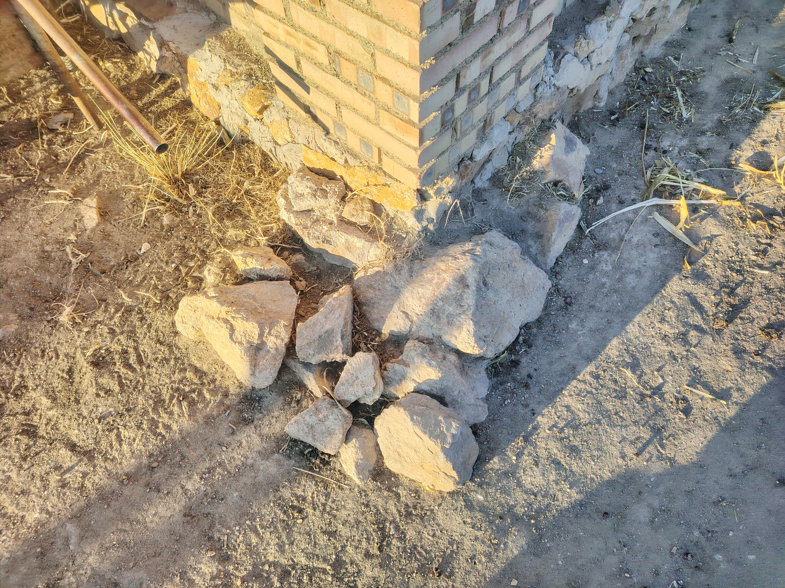

The "slow time" in my mind lingered on a summer night when my friends and I were 
playing outside, looking at the tall buildings outside from out 'urban village'.But since then, the concept of
time has been blurred for me: a day goes by verry fast, and a year passes in the blink of an eye especially now.

Does this mean that time is merely a relative concept? and when we say "very far", this concept is different for people at different ages? and when we look forward to 
the future, time seems to move relatively slower in our memory? 
I would say yes, time is relative. 

But this still doesn't explain why time seems to pass so quickly now; it's as if we havem't done 
anything, and the day just slips away. Maybe we just being too concerned about or too focused on the concept of time actually reduced the attention 
paid to what really matter.

When I looked back, everything had changed, yet it seemed that nothing had changed at all. 

Even if humans possess great power, they wouldn't care about the trees growing unchecked at the village entrance. They've been there since my childhood, and the ones truly qualified to say they've witnessed the changes of time are actually these trees.

They just stand there, season after season, day in and day out. They’ve seen it all—birth, aging, sickness, and death—but they don't do pity, charity, or sorrow. They just watch, in total silence. Such a profound power in silence.

The stones at the village entrance—my grandma’s favorite 'bench' for her whole life—are still piled there just as they were. But she, and the world she knew, are long gone.