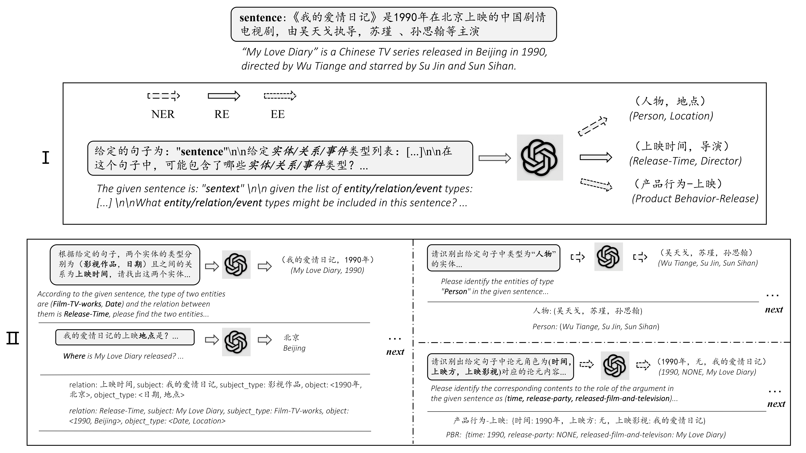

> 本文写在重构Cola-lab的ChatIE和GPT4IE项目后，对近期所学进行梳理和总结并做一些记录和反思。

原项目地址：[https://github.com/cocacola-lab/ChatIE](https://github.com/cocacola-lab/ChatIE)

重构项目地址：[https://github.com/lavanceeee/ChatIE](https://github.com/lavanceeee/ChatIE)

体验地址：[http://chatie.service.2jone.top/](http://chatie.service.2jone.top/)

GPT4IE重构: [https://github.com/lavanceeee/GPT4IE](https://github.com/lavanceeee/GPT4IE)

## 写在前面

从本项目中，我首次系统性地了解了 **IE的整体工作流程**，包括从原始文本中识别命名实体、抽取关系以及事件要素的完整链路。通过对代码与论文的深入研读，我对IE中不同模块的作用、相互衔接方式以及对实验结果的影响有了更直观的理解。这个过程不仅帮助我从实践层面加深了对NLP 技术的认识，**也让我意识到IE在知识图谱构建、智能问答和信息检索等场景中的潜在价值**，激发了我探索和深入研究自然语言处理的兴趣。

通过本次项目实践，我在工程化能力上得到了很大提升。**在 Linux 使用与服务管理 方面更加熟练**，掌握了编写和配置 service 文件的方法，并能灵活运用启动、停止与重启等相关命令。在前端部署上突破了以往的困难，**能够独立编写 Nginx 配置文件并顺利完成前端界面的部署**。与此同时，在后端部署方面也得到了进一步巩固与深化，能够熟练地使用 Gunicorn 部署后端项目，**并通过 systemd 实现进程的高效管理**。同时让我在自动化运维方面**初步掌握了 GitHub Actions 的使用**，认识到其在 CI/CD 自动化中的重要作用，但在编写 YAML 配置文件上仍需进一步实践与积累。

在代码编写方面，我进一步加深了对 **Vue3 父子组件通信机制** 的理解，明确了父组件与子组件之间通过 `defineProps` 和 `emit 信号机制` 实现数据与事件传递。这一点与我在之前的 [PyQt 项目](https://github.com/lavanceeee/Michelson-Fringe-Counting-py)
中掌握的 Qt 信号槽机制 有一定相似性，因此理解起来较为顺利。Vue3 的信号槽机制不仅简洁，而且能够有效提升组件的内聚性和前端项目的工程化水平。我还知道了 Netlify 部署中使用的 Edge Functions 本质上运行在 Node.js 环境下，因此在编写函数时需要遵循 CommonJS 语法，或者显式启用 ESM 模块支持，以确保代码兼容性。

我发现了我目前存在的许多不足之处。**其中最大的问题在于科研素养不足：对于一个问题无法从专业性，系统性，纯理论化的角度去看待它**。或者说，我的基础学科知识储备很少，少到我不知道它的底层原理实现是怎么样的。即使是一点点查询关于这个领域的知识，我也会被一长串的公式吓住：虽然我学习了线性代数，高等数学等知识，可是有时看到一个公式甚至完全看不懂它在说什么，说到底，我只是会考试的机器，并没有真正理解公式本身。上述便是我这些天或者说近几个月发现的自身的最大的问题，也是我接下来一年的努力方向，去尽快补上我那少得可怜的基础知识。

## Information Extraction

> Information extraction (IE) is the task of automatically extracting structured information from unstructured and/or semi-structured machine-readable documents and other electronically represented sources.[^](https://en.wikipedia.org/wiki/Information_extraction)

信息抽取是自然语言处理领域的基础任务，其核心目标是从非结构化文本中自动识别并提取结构化信息。该任务涵盖命名实体识别(NER)用于识别文本中的人名、地名、机构等实体，关系抽取(RE)发现实体间的语义关系如"工作于"、"属于"等，事件抽取(EE)识别事件类型及其参与者、时间、地点等要素。

传统的零样本IE实现主要依赖规则匹配、无监督学习和迁移学习方法。规则匹配方法通过手工设计正则表达式和语言模式来识别目标信息，但面临规则维护困难和泛化能力不足的问题。无监督学习方法如聚类算法和主题模型能够发现数据中的潜在模式，但提取精度有限且难以处理复杂的结构化关系。迁移学习方法通过在相关领域的标注数据上预训练模型，然后迁移到目标领域，但仍需要一定量的目标域数据进行微调。这些方法的根本挑战在于结构化数据包含多个相互依赖的元素，通过一次预测难以准确提取，特别是对于关系抽取等复杂任务。

但传统方法存在着明显的局限性如：标注成本高昂，单个领域的数据标注往往需要数万至数十万的人工投入[^](https://startup.aliyun.com/info/1065921.html)；模型的领域适应性较差，在新领域上性能急剧下降；对长尾实体和复杂关系的识别能力有限。

北京交通大学的CoLa-lab提出了使用ChatGPT等大模型实现零样本信息抽取的方法并通过JS和Python等编程语言做了实现。

## Zero-Shot Information Extraction 🐬

零样本信息抽取(Zero-shot Information Extraction)旨在从未标注的文本中构建信息抽取系统，无需人工干预即可将非结构化文本转换为结构化数据格式，随着ChatGPT等大语言模型在零样本设置下展现出的卓越性能，基于提示的方法为零样本IE开辟了新的研究路径。

零样本IE的实现过程通常采用任务分解策略，将复杂的信息抽取任务拆解为多个较简单的子任务。以关系抽取为例，流水线方法如PURE首先识别文本中的实体，然后预测实体间的关系类型。另一种方法将关系抽取视为问答过程，先根据关系模板提取主语实体，再基于主语和关系类型提取宾语实体。这种分阶段处理策略能够降低单次预测的复杂度，但传统方法仍依赖标注数据进行模块训练。

### 实现细节

本论文基于提示工程和上下文对话方法通过设计好的输入模板prompt引导ChatGPT完成抽取任务，将抽取任务转换为两阶段框架的多轮问答问题：



第一阶段确定句子中可能存在的元素类型，第二阶段对每种元素类型继续进行主体抽取。每轮对话基于设计的模板构建提示，并将前轮提取的信息作为第二轮对话的上下文输入。最终将各轮提取的信息组合成结构化数据并得到结构化结果，渲染为表格并使用 `vis.js` 做结果的可视化。

实验结果表明，虽然直接使用原始任务指令的vanilla ChatGPT无法有效解决IE任务，但通过ChatIE框架将任务分解为多个简单子任务后，系统性能显著提升，在六个跨中英两种语言的数据集上甚至超越了部分全监督模型的表现[^](https://github.com/cocacola-lab/ChatIE?tab=readme-ov-file#results)（NYT11-HRL），为资源受限环境下构建IE模型提供了新的技术路径。

## 项目重构

### 原系统分析

原项目主要面向快速搭建与数据集测试，**设计目标我认为更多是验证核心想法与实验可行性，而非追求完整的工程化实现**。因此，**原项目在模块化、代码规范性以及可扩展性等方面考虑较少，更倾向于概念验证型原型。** 在深入研读相关学术论文并理解项目代码的基础上，我认为可以从整体架构出发对该项目进行系统性重构，以提升其工程化水平、增强模块化与规范性，使项目更加完整和可维护。

以下列出了我认为原项目中存在的局限性，也是后续重构的切入点：

1. **工程化水平不足：** 项目整体工程化程度有限，`App.js` 包含了所有的核心逻辑，包括状态管理、UI渲染、业务等全部功能，代码可读性较差。

2. **密钥未安全管理：** 密钥硬编码在代码中，缺乏安全存储与访问机制，存在泄露风险，不符合安全性规范。

### 工程化改进

起初，我的想法是完全依赖 Vue 与 JavaScript 对项目进行重构，并由前端承担核心逻辑的实现。与传统的‘前端请求后端，再由后端转发至模型提供商’的方式相比，前端直接通过 HTTP 请求访问模型提供商在理论上能够减少通信环节，从而提升响应速度。将数据处理逻辑集中于前端不仅符合整体架构的内聚性要求，同时也有助于增强系统的一致性与执行效率。

然而，纯前端的实现方案在 API Key 的安全存储方面存在根本性限制：前端代码在浏览器端以静态资源形式运行，所有脚本最终都会被下载至用户本地环境并在客户端执行。因此，无论 API Key 以何种方式嵌入代码或配置文件，均可能通过浏览器开发者工具、网络请求分析或反编译前端资源的方式被直接获取。这意味着任何在前端暴露的密钥在本质上都无法避免泄露风险。

基于上述分析，出于安全性与规范性的考虑，最终采用 Vue + JavaScript + Flask 的形式：

通过 Vue 实现组件化开发和声明式渲染，提升前端代码的复用性、可维护性与开发效率；
使用 JavaScript 进行数据处理，结合后端部署和环境变量中的 API key 管理实现密钥的安全存储与请求转发职能，从而在保证数据处理效率的同时，有效规避敏感信息泄露的隐患；通过 Github Actions 实现CI/CD自动化。


```text
ChatIE/
├─ .github/
│  └─ workflows/
│     └─ deploy-banked.yml
├─ src/
│  ├─ assets/
│  │  ├─ system_prompt/
│  │  └─ global.css
│  ├─ components/
│  │  ├─ FormSection.vue
│  │  ├─ MainContainer.vue
│  │  ├─ MainPage.vue
│  │  ├─ NetworkVis.vue
│  │  └─ ResultSection.vue
│  ├─ composables/
│  │  ├─ api.js
│  │  ├─ callAPI.js
│  │  ├─ loadPattern.js
│  │  └─ useData.js
│  ├─ store/
│  │  ├─ index.js
│  │  └─ storeData.js
│  ├─ utils/
│  │  ├─ regs.js
│  │  └─ vis_utils.js
│  ├─ App.vue
│  ├─ main.js
│  └─ style.css
├─ .gitignore
├─ app.py
├─ index.html
├─ package-lock.json
├─ package.json
├─ README.md
├─ requirements.txt
└─ vite.config.js
 ```

### View Components

视图解耦与通信通过 Vue3 的emit信号槽机制与props数据传递实现。MainContainer作为父组件通过props向下传递状态，子组件通过emit向上传递数据，形成单向数据流的组件通信模式：

```HTML
<template>
  <FormSection
    @update:selected-pattern="(newPattern) => Object.assign(selectedPattern, newPattern)"
    @update:users-input-form="(newUsersInput) => Object.assign(usersInputForm, newUsersInput)"
    @submit="submitInput"
    @clear="clearInput"
    :selected-pattern="selectedPattern"
    :users-input-form="usersInputForm"
    :isLoading="isLoading"
  />
  <NetworkVis :response-data="result" />
  <ResultSection :response-data="result" />
</template>
```
`FormSection`组件采用双向通信机制，并由watch监听实现双向数据同步：通过 `defineProps` 接收父组件状态，通过emit向上发射事件信号。组件内部维护本地reactive状态副本，watch监听实现用户输入并上报：

```js
<script setup>
const props = defineProps({
  selectedPattern: { type: Object, required: true },
  usersInputForm: { type: Object, required: true },
  isLoading: { type: Boolean, default: false },
});

const emit = defineEmits([
  "update:selected-pattern",
  "update:users-input-form",
  "submit", 
  "clear"
]);

const localPattern = reactive({ ...props.selectedPattern });

watch(localPattern, (newValue) => {
  emit("update:selected-pattern", { ...newValue });
}, { deep: true });

const submmitInput = () => {
  emit("submit");
};
</script>
```

`NetworkVis`, `ResultSection` 组件采用单向数据传递，仅接受父组件传递的数据，分别实现数据可视化和markdown格式表格转化过程。可视化组件代码如下：

```js
<script setup>
const props = defineProps({
  responseData: { type: String, default: "" }
});

watch(() => props.responseData, (newValue) => {
  if (newValue) {
    result.value = { ...mdConverter(newValue) };
    updateNetwork(result.value);
  } else {
    nodes.clear();
    edges.clear();
  }
});
</script>
```
通过emit信号槽与props的组合使用，实现了视图组件的完全解耦：`MainContainer` 作为协调器管理全局状态，`FormSection` 作为交互组件承担用户输入的收集与表单上报，`NetworkVis` 与 `ResultSection` 作为展示组件专注数据渲染。这种架构模式确保了组件职责的单一性，每个组件都可以独立开发、测试与维护，同时也是大型前端项目规范化的最佳实践。

### Controller

`loadPattern` 模块负责根据全局状态动态加载模板匹配规则。在接收到用户数据后，该模块首先检查用户自定义的匹配模式是否存在，若存在则直接加载并存入全局状态；否则根据用户语言和模型类型，从默认 JSON 文件中加载匹配规则。

```js
export async function loadPattern() {
  try {
    if (storeData.getUsersPattern()) {
      const pattern = JSON.parse(storeData.getUsersPattern());
      storeData.setPattern(pattern);
    } else {
      const language = storeData.getLanguage();
      const model = storeData.getModel();
      const file = `default_match_pattern.json`;
      const response = await fetch(file); 

      if (!response.ok) {
        throw new Error(`failed loading default pattern: ${response.status}`);
      }

      const data = await response.json();
      const default_pattern = data[language][model];

      storeData.setPattern(default_pattern);
    }
  } catch (error) {
    throw new Error(`不合法的JSON格式，请检查：${error}`);
  }
}
```

`buildPrompt` 模块用于根据指定阶段（`stage_1` 或 `stage_2`）、用户语言及模型类型动态加载系统提示词文件。该函数通过异步请求读取对应的 prompt 文件，并返回原始文本内容，为后续提示词替换提供基础模板，确保每个阶段的提示词与用户设置及模型类型保持一致。

```js
export async function buildPrompt(stage) {
  //stage: string -> "stage_1" "stage_2"
  const language = storeData.getLanguage();
  const model = storeData.getModel();
  const promptFile = `system_prompt/${model}/${stage}/${language}.prompt`;

  const response = await fetch(promptFile);

  if (!response.ok) {
    throw new Error(`failed loading prompt: ${response.status}`);
  }

  const orginal_prompt = await response.text();
  return orginal_prompt;
}
```
`replacePrompt` 模块负责将原始提示词模板中的占位符替换为实际数据，从而生成阶段性最终提示词。根据模型类型（RE、EE、NER）及处理阶段（`stage_1`、`stage_2`），模块会将用户输入句子、匹配规则及前一阶段结果嵌入到模板中，形成两阶段的提示词序列。

```js
export function replacePrompt(stage, orginal_prompt, result_of_stage1) {
  const sentence = storeData.getSentence();
  const model = storeData.getModel();
  const pattern = storeData.getPattern();

  let prompt = "";

  switch (model) {
    case "RE":
      switch (stage) {
        case "stage_1":
          orginal_prompt = orginal_prompt.replace("$sentence", sentence);
          prompt = orginal_prompt.replace("$relations", pattern["rtl"]);
          break; 

        case "stage_2":
          orginal_prompt = orginal_prompt.replace(/\$stl/g, pattern["stl"]); //replace all
          orginal_prompt = orginal_prompt.replace(/\$otl/g, pattern["otl"]);
          prompt = orginal_prompt.replace("$relation", result_of_stage1);
          break;
      }
      break;

    case "EE":
      switch (stage) {
        case "stage_1":
          orginal_prompt = orginal_prompt.replace("$sentence", sentence);
          prompt = orginal_prompt.replace(
            "$etl",
            JSON.stringify(pattern["etl"])
          );
          break;

        case "stage_2":
          orginal_prompt = orginal_prompt.replace(
            "$etl",
            JSON.stringify(pattern["etl"])
          );
          prompt = orginal_prompt.replace("$first_stage", result_of_stage1);

          break;
      }
      break;

    case "NER":
      switch (stage) {
        case "stage_1":
          orginal_prompt = orginal_prompt.replace("$sentence", sentence);
          prompt = orginal_prompt.replace("$etl", pattern["etl"]);
          break;

        case "stage_2":
          prompt = orginal_prompt.replace("$etl", pattern["etl"]);
          break;
      }
      break;
  }
  return prompt;
}
```

同时，通过 `storeData` 以**单例模式实现全局状态管理**，确保数据在各模块间保持一致性；并对外提供统一的 getter 与 setter 方法，增强该模块的内聚性与可维护性。

`utils` 工具函数用来实现Markdown表格到可视化数据结构的智能转换，通过策略模式处理异构数据格式,以下给出了如何将RE的markdown格式数据转换为结构化Object对象形式:

```js
function convertRE(markdown) {
  const lines = markdown.split("\n").filter((line) => line.trim() !== "");
  
  if (lines.length < 2) {
    return { stl: [], otl: [], relation: [] };
  }

  const stl = [];
  const otl = [];
  const relation = [];

  for (let i = 2; i < lines.length; i++) {
    const row = lines[i]
      .split("|")
      .map((cell) => cell.trim())
      .filter((cell) => cell !== "");

    stl.push(row[0]);
    otl.push(row[1]);
    relation.push(row[2]);
  }

  return { stl, otl, relation };
}
```

通过逻辑分层与解耦，我将原项目中以 Python 实现的核心逻辑用 JavaScript 进行了模块化重构，从全局状态管理到功能实现，再到工具函数支撑，形成了清晰的层次结构，同时也实现了两阶段的对话提升抽取精度，渐进式理解最大化准确性，并结合策略模式实现对 RE/NER/EE 三类模型的统一支持；利用 JSON 配置实现参数化模板，支持多语言、多模型的灵活配置，也极大地减少了重复代码的编写，具备良好的扩展性。

### CI/CD

后端部分仅使用 Flask 作为请求转发层，将密钥安全地存放在服务器端，并通过环境变量读取，避免硬编码暴露，从而有效提升整体的安全性与可维护性。结合 GitHub Actions，使用 Gunicorn 部署后端后，实现代码推送后的自动化部署与服务重启：


```Python

app = Flask(__name__)

CORS(app, resources= {
    r"/api/call_doubao": {
        "origins": ["http://localhost:5173", "http://chatie.service.2jone.top"],
    }
})

DOUBAO_KEY = os.environ.get("DOUBAO_API_KEY")

@app.route("/api/call_doubao", methods=["POST"])
def call_doubao_api():
    try:
        data = request.get_json()
        messages = data.get("messages", [])
        users_api_key = data.get("apiKey", "")
        API_Key = users_api_key if users_api_key != "" else DOUBAO_KEY

        if not API_Key:
            error_msg = {"error": "还未设置APIKEY到环境变量"}

            return Response(
                json.dumps(error_msg, ensure_ascii=False),
                mimetype="application/json",
                status=500
            )
        
        client = OpenAI(
            base_url="https://ark.cn-beijing.volces.com/api/v3",
            api_key=API_Key
        )

        completion = client.chat.completions.create(
            model="doubao-1-5-pro-32k-250115",
            messages=messages
        )

        result = completion.choices[0].message.content

        return Response(
            json.dumps({"result": result}),
            mimetype="application/json",
            status=200
        )

    except Exception as e:
         return Response(
            json.dumps({"error": f"服务器端出错了：{str(e)}"}, ensure_ascii=False),
            mimetype="application/json",
            status=500
        )
```

## 一些学习笔记

### Flask项目部署

Gunicorn是一个Python WSGI Http服务器，专为生产环境设计，比起Flask自带服务器来说，支持多进程/多线程，负载均衡等，更加稳定，性能更好。

```ini
pip insatll gunicorn

gunicorn [OPTIONS] APP_MODULE
 
# app:app [project name]:[service name]
gunicorn -w 4 -b 0.0.0.0:8000 app:app

#查看进程
ps ax | grep gunicorn 

```
|参数名|作用|示例|
|---|---|---|
|-w|指定工作进程|-w 4(四个工作进程)|
|-b|绑定地址和端口号|-b 127.0.0.1:8000|
|--daemon|后台运行|---|

### 使用systemd管理gunicorn

```ini
sudo nano /etc/systemd/system/newapp.service
```

```ini
[Unit]
Description= new app
After=network.target

[Service]
User=oneuser
#启动目录
WorkingDirectory=/var/www/appservice
#启动命令
ExecStart=/var/www/appservice/venv/bin/gunicorn -w 4 -b 0.0.0.0:8000 app:app
#崩溃重启
Restart=always

[Install]
WantedBy=multi-user.target
```

```ini
#启动服务
sudo systemctl start newapp

#停止服务
sudo systemctl stop newapp

#重启服务
sudo systemctl restart newapp

#开机自启
sudo systemctl enable newapp

#运行状态
sudo systemctl status newapp
```
### Nginx配置

```ini
sudo systemctl reload nginx 

sudo systemtcl status nginx

```


