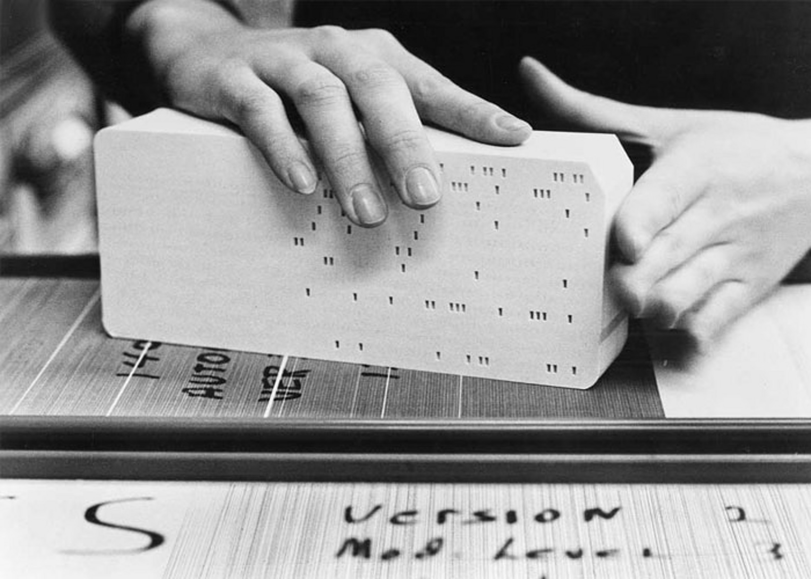

## 一些历史

1946-1951，人机交互主要通过 [打孔卡](https://www.wikiwand.com/en/articles/Punched_card) 进行。通过打孔写入程序和数据，将这些卡片成批输入到制表机中进行数据运算并得到结果。

IBM前身CTR公司的打孔卡在当时最为出名，IBM称其为信息时代最早的标志，20世纪自动化的有力象征[^1]：

> It was one of the earliest icons of the Information Age: a simple punched card produced by IBM, commonly known as “the IBM card.” 

早期的“计算机”较多采用这种方式进行数据的输入输出，然而这些计算机最初的设计一次只能执行单个作业，且程序运行的大部分时间均在进行读卡，打印等I/O操作，CPU的利用率较低。

 

## 批处理系统 

### 单道批处理系统

来到20世纪60年代，开始出现批处理系统。最初的批处理模型为单道批处理，“道”即为内存中作业的数量[^2]。通过 "monitor" _(需解释)_ 监督程序监控整个作业队列，通过磁带将用户的多个同类别作业组成同一个批次（batch）顺序执行，监督程序每次只向内存调入一个作业，自动管理输入输出和作业切换。每一个队列的执行顺序仍是I/O阻塞的，也就是说只有完整地执行完当前作业的全部计算和I/O操作后，后一个作业才会开启。

该模型初步实现了作业和资源的自动化管理，“操作系统”这一概念也就此诞生[^3]。

### 多道批处理系统

多道程序设计强调在内存中加载多个程序，提高CPU的利用率。这些作业通过磁带输入，组成一个队列，系统按一定的调度原则每次从后备作业队列中选取一个或多个作业进入内存运行，运行作业结束、退出运行和后备作业进入运行均由系统自动实现，从而在系统中形成一个自动转接的、连续的作业流[^4]。

这样做的好处是系统的资源利用率，效率都得到了提高。

最具代表性的就是IBM System/360， 将“操作系统”作为一个完整的系统软件确立下来，通过“操作系统”这个抽象来调度硬件，实现软件与硬件的解耦，同一个软件可运行在不同的硬件平台上[^5]。OS/360的项目经理 Fred Brooks 根据在开发过程中的经验写了著名的《人月神话》一书来详细介绍其团队在开发过程中的软件工程经验。

## 分时系统与Unix

出于当时大型机的价格考虑和批处理系统的实时交互效果差的现实，分时系统主要解决“如何让多人共享设备和实时交互”的问题[^7]。通过时间片轮转给每一次运行在CPU上的程序设定一个最大运行时间，轮转切换给每一个用户进程。当时间切片足够短时，我们也可以很好理解每个用户似乎是在独自占有CPU的[^8]。

[CtsS](https://en.wikipedia.org/wiki/Compatible_Time-Sharing_System) 是MIT在1961年开发的第一个分时系统，后来发展为Multics系统。

由于 Multics 推进缓慢，贝尔实验室退出了这个项目。肯 · 汤普森（Ken Thompson）将他的《星际旅行》游戏迁移到一台破旧 PDP-7 机器的过程中，与丹尼斯 · 里奇（Dennis Ritchie）一起设计了新的系统，即Unix。当时的Unix由汇编语言编写，移植性不高。因此，肯·汤普森从零写了B语言，Unix 被移植到了稍微先进一些的 PDP-11 计算机上。丹尼斯·里奇在此基础上创建了C语言，并使用C语言重写了Unix内核，使得Unix成为了可移植的操作系统[^9]。

## 类Unix

1977年，加州大学伯克利分校发布了BSD（Berkeley Software Distribution），在Unix基础上增加了TCP/IP网络协议栈和虚拟内存管理。同时期，AT&T公司也逐渐推进 System V的Unix商业版本，可是定价较为昂贵，这也是为什么，不允许软件软件自由修改和分发。BSD和System V是当时类Unix的两大分支，软件兼容性问题逐渐暴露出来[^10]。

因不满闭源商业软件的种种限制和逐渐暴露出来的兼容性问题，
1985年理查德·斯托曼([Richard Stallman](https://en.wikipedia.org/wiki/Richard_Stallman))发起GNU项目，以编写一个完全由自由软件组成的类 Unix 计算机操作系统并开发了很多GNU软件。
1991年林纳斯·托瓦兹（[Linus Torvalds](https://en.wikipedia.org/wiki/Linus_Torvalds)）发布了Linux内核，与GNU软件一起构成了完整的GNU/Linux操作系统。Linux基于GPL许可证，复制程序的全部或部分对于程序员来说就像呼吸一样自然。

## 谈起操作系统，我们在讨论什么

1980年代，个人电脑开始出现和流行。从DOS系统到如今成熟的图形界面，当我试图理解电脑如何管理和调度数十个进程的时候，我们在讨论多线程，CPU调度算法；讨论内存管理，以及各种I/O管理策略。可是在了解各种调度算法之前，花些时间从宏观上把握一下这段历史也同样有意思。

[^1]: https://www.ibm.com/history/punched-card?utm_source=chatgpt.com
[^2]: https://baike.baidu.com/item/%E5%8D%95%E9%81%93%E6%89%B9%E5%A4%84%E7%90%86%E7%B3%BB%E7%BB%9F/3979111
[^3]: https://millosh.wordpress.com/2007/09/07/the-worlds-first-computer-operating-system-implemented-at-general-motors-research-labs-in-warren-michigan-in-1955/
[^4]: https://baike.baidu.com/item/%E5%A4%9A%E9%81%93%E6%89%B9%E5%A4%84%E7%90%86%E7%B3%BB%E7%BB%9F/3792844
[^5]: https://www.ibm.com/history/system-360?utm_source=chatgpt.com
[^6]: https://zhuanlan.zhihu.com/p/440741551
[^7]: https://zhuanlan.zhihu.com/p/1902465269101733686
[^8]: https://baike.baidu.com/item/%E5%88%86%E6%97%B6%E6%93%8D%E4%BD%9C%E7%B3%BB%E7%BB%9F/3067636
[^9]: https://zhuanlan.zhihu.com/p/563756561
[^10]: https://danielmiessler.com/blog/the-differences-between-bsd-and-system-v-unix