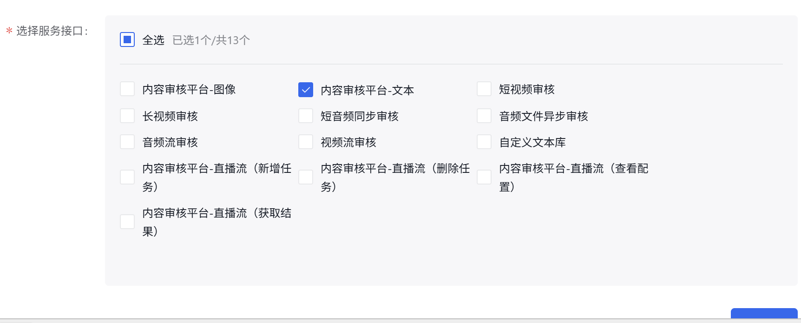

## OpenAI敏感词审查服务

OpenAI提供了免费的[敏感词审查服务](https://platform.openai.com/docs/guides/moderation)，该接口完全免费，可以实现文本，图片等内容的审查。

但是效果如何需要自行验证，官方的具体检测标定内容如下，检测过程基于AI模型完成，所以可能相对来说不够灵活，但作为一个免费服务还是很好的，值得一试。

如果你从来没有使用过OpenAI的API服务，且账户中余额为0，在调用时大概率会出现请求次数过多的错误，但是其实不是请求次数太多了，而是账号没有余额，换句话说，这个服务实际上不是免费的，必须先充值最低5美金。

以下是完整的分类：

| Category               | Description                                                                                                                                                                                                 | Models    | Inputs            |
|------------------------|-------------------------------------------------------------------------------------------------------------------------------------------------------------------------------------------------------------|-----------|-------------------|
| harassment             | Content that expresses, incites, or promotes harassing language towards any target.                                                                                                                          | All       | Text only         |
| harassment/threatening | Harassment content that also includes violence or serious harm towards any target.                                                                                                                           | All       | Text only         |
| hate                   | Content that expresses, incites, or promotes hate based on race, gender, ethnicity, religion, nationality, sexual orientation, disability status, or caste. Hateful content aimed at non-protected groups (e.g., chess players) is harassment. | All       | Text only         |
| hate/threatening       | Hateful content that also includes violence or serious harm towards the targeted group based on race, gender, ethnicity, religion, nationality, sexual orientation, disability status, or caste.               | All       | Text only         |
| illicit                | Content that gives advice or instruction on how to commit illicit acts. A phrase like "how to shoplift" would fit this category.                                                                              | Omni only | Text only         |
| illicit/violent        | The same types of content flagged by the illicit category, but also includes references to violence or procuring a weapon.                                                                                    | Omni only | Text only         |
| self-harm              | Content that promotes, encourages, or depicts acts of self-harm, such as suicide, cutting, and eating disorders.                                                                                              | All       | Text and images   |
| self-harm/intent       | Content where the speaker expresses that they are engaging or intend to engage in acts of self-harm, such as suicide, cutting, and eating disorders.                                                          | All       | Text and images   |
| self-harm/instructions | Content that encourages performing acts of self-harm, such as suicide, cutting, and eating disorders, or that gives instructions or advice on how to commit such acts.                                          | All       | Text and images   |
| sexual                 | Content meant to arouse sexual excitement, such as the description of sexual activity, or that promotes sexual services (excluding sex education and wellness).                                                | All       | Text and images   |
| sexual/minors          | Sexual content that includes an individual who is under 18 years old.                                                                                                                                       | All       | Text only         |
| violence               | Content that depicts death, violence, or physical injury.                                                                                                                                                   | All       | Text and images   |
| violence/graphic       | Content that depicts death, violence, or physical injury in graphic detail.                                                                                                                                 | All       | Text and images   |

## 百度敏感词审查

相较于AI审查，传统的审查服务API更全面，审查的颗粒度也更细致一些，我在项目中选择了[百度内容审查平台](https://cloud.baidu.com/doc/ANTIPORN/index.html)的服务。

百度的审查服务提供了更细粒度的审查服务选择，大体上包括文本和图片审查以及统计服务，这里以文本审查为例进行说明，新人登陆后还会送较大额度的免费体验名额。

选择创建一个应用接入，可以看到百度审查接口提供了很丰富的审查种类:



## Nuxt项目实践

先获取token。

```ts
// server/utils/baidu.ts

export const getBaiduToken = async () => {
    const API_KEY = process.env.BAIDU_API_KEY;
    const SECRET_KEY = process.env.BAIDU_SECRET_KEY;

    const authUrl = `https://aip.baidubce.com/oauth/2.0/token?grant_type=client_credentials&client_id=${API_KEY}&client_secret=${SECRET_KEY}`;

    try {
        const data: any = await $fetch(authUrl, { method: 'POST' });
        return data.access_token;
    } catch (error) {
        console.error('获取百度Token失败:', error);
        throw createError({
            statusCode: 500,
            statusMessage: 'Baidu Auth Failed',
        });
    }
};
```

在 `server/api` 下实现一个Edge Function来进行文本审查 `moderation.post.ts`。

```ts
// server/api/moderation.post.ts

export default defineEventHandler(async (event) => {
    const body = await readBody(event);
    const { text } = body;

    if (!text) {
        throw createError({ statusCode: 400, statusMessage: 'Text is required' });
    }

    // util function to get Token
    const accessToken = await getBaiduToken();

    // censor interface
    try {
        const censorUrl = `https://aip.baidubce.com/rest/2.0/solution/v1/text_censor/v2/user_defined?access_token=${accessToken}`;

        const response: any = await $fetch(censorUrl, {
            method: 'POST',
            headers: { 'Content-Type': 'application/x-www-form-urlencoded' },
            body: new URLSearchParams({ text })
        });
        
        // response is orginal json string
        return response;
    } catch (error) {
        console.log(error);
        throw createError({ statusCode: 500, statusMessage: 'Audit Failed' });
    }
});
```

在工具函数中定义审查接口的调用，需要注意的是，这里的response返回的是jsON，需要手动解析。
```ts
//内容审查
export async function checkText(text: string) {
    try {
        const res = await $fetch('/api/moderation', {
            method: 'POST',
            body: {
                text: text
            }
        }) as any;

        const result = jsON.parse(res);

        if (result.conclusionType != 1) {
            ElMessage.error('内容可能包含不合理内容，请重新输入！');
            return false;
        }
        return true;
    } catch (e: any) {
        ElMessage.error(e.message || '内容审查失败');
        return false;
    }
}
```

接口写好后就可以在业务中调用了，比如可以在用户发帖之前进行拦截，将标题和内容拼接后进行审查，根据结果处理是否允许发帖：

```ts
const handleSubmit = async () => {
    if (!isFormValid.value) return;

    try {

        const titleIsSafe = await checkText(title.value + content.value);

        if (!titleIsSafe) return;

        await createPost({
            sectionId: props.sectionId,
            title: title.value,
            content: content.value,
            images: images.value.length > 0 ? images.value.join(',') : undefined
        });

        content.value = '';
        title.value = '';
        images.value = [];
        ElMessage.success('发布成功');
        emit('success');
    } catch (e: any) {
        ElMessage.error(e.message || '发布失败');
    }
};

```

但是需要注意的是，绝对不能只在前端进行校验，**当用户将内容发到后端后，仍必须再次进行敏感词审查**，并对文章做出封禁/删除/尽自己可见的操作。因为前端完全可以直接使用Postman调 `createPost` 接口从而绕过
 `checkText` 函数。知乎发文章就是这样的，知乎没有前端校验的逻辑，即使文章中包含某些敏感词也可以发表，但是刷新界面后，文章就被自动删除了，实际上就是这样的情况。

 比较好笑的是，知乎这样的平台的敏感词审查机制也不是很强力，可以被特殊符号标记绕过。


## 小结

在这篇笔记中我探讨了如何使用OpenAI的服务或者百度云的审查服务进行文本内容审查和标记通过这次笔记我初次了解了内容审查的工作原理以及其是如何进行敏感词审查的流程。


