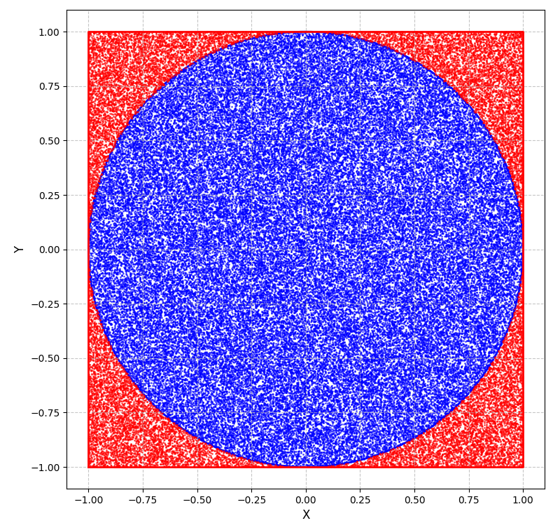
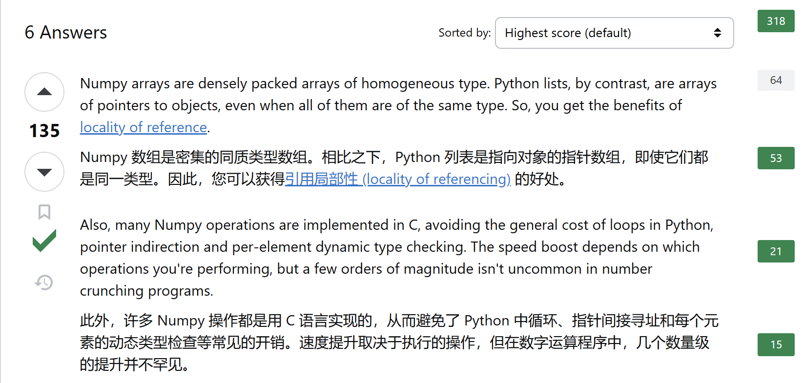
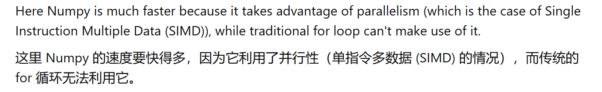

> 这是我在了解蒙特卡罗算法时，对于使用Numpy实现和for循环实现进行不同实现效率的底层差异的一个浅薄了解。

蒙特卡罗算法是一种基于随机抽样的数值计算方法，核心就是使用“随机性”解决“确定性”的问题。其典型表现形式是：所求解问题可以转化为某种随机分布的特征数[^](https://zh.wikipedia.org/wiki/%E8%92%99%E5%9C%B0%E5%8D%A1%E7%BE%85%E6%96%B9%E6%B3%95)
。

一个很典型的例子就是：求π的近似值。

在直角坐标系中，以原点为圆心，做单位圆，同时做它的外切正方形，之后进行N次随机实验，根据大数定律[^](https://zh.wikipedia.org/wiki/%E5%A4%A7%E6%95%B8%E6%B3%95%E5%89%87)
,当N足够大时：落在圆内的点数/总点数 = 圆面积/正方形面积。



### 编码

使用`time.time()`观察输出时间

```Python
import time
import numpy as np
import random

n = 100_000_000 

start_np = time.time()

points = np.random.uniform(-1, 1, size=(n, 2))
distance_squared = np.sum(points**2, axis=1)
inside = np.sum(distance_squared <= 1)
pi_numpy = 4 * inside / n

end_np = time.time()

time_np = end_np - start_np

#重置inside
inside = 0

start_random = time.time()

for _ in range(n):
    x = random.uniform(-1, 1)
    y = random.uniform(-1, 1)
    if x**2 + y**2 <= 1:
        inside += 1
pi_random = 4 * inside / n

end_random = time.time()
time_random = end_random - start_random

print(f"Numpy计算结果: {pi_numpy:.10f}, 时间: {time_np:.2f}秒")
print(f"random计算结果: {pi_random:.10f}, 时间: {time_random:.2f}秒")
```

#### 第一次

```
Numpy计算结果: 3.1416472400, 时间: 4.96秒
random计算结果: 3.1413288800, 时间: 49.20秒
```
#### 第二次
```
Numpy计算结果: 3.1415549200, 时间: 3.58秒
random计算结果: 3.1418608000, 时间: 50.51秒
```
明显的区别在于运行时间方面差的很多。

## 差异
使用random库方案时间开销主要在for循环上，python本身的动态特性加上随机数生成器的时间再加上for循环本身边界检查，类型推断等的时间就让这种方案实现蒙特卡罗算法自然是不低了。

Numpy底层使用C实现，使用SIMD指令[^](https://en.wikipedia.org/wiki/Single_instruction,_multiple_data)一次性处理整个数组,CPU在单条指令中并行计算所有点的平方和，在实验结果上表明，还是Numpy在大数处理上占优势，更能发挥硬件的性能。






