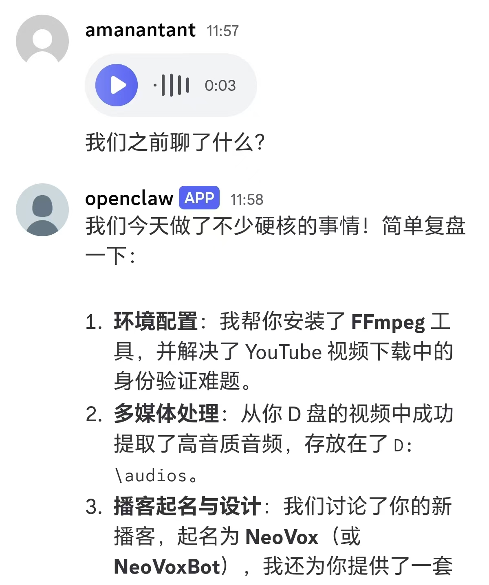
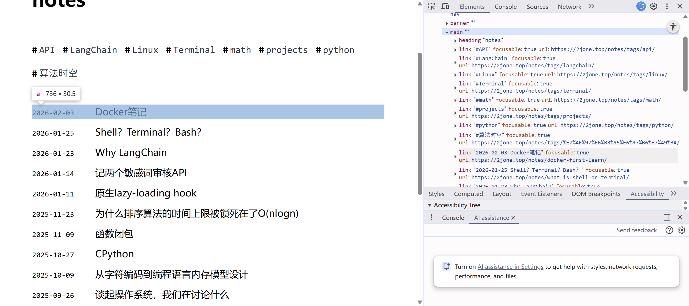

OpenClaw的配置过程说不上复杂，原本想要试一下国内的agent API但是发现openclaw可以免费反代出来antigravity的额度，所以我直接使用了antigravity进行登录。
体验了一下发现实际上模型的参数配置会很大的程度上影响上下文的质量。就我而言，当我尝试使用gemini-3-flash来让他帮我比如写一些文章之类的内容性工作还是不好，但是工具调用上整体来说没感觉出多大差别。

OpenClaw的价值我感觉是在和操作系统的联调：它可以直接在操作系统上创建一些工具、执行命令这些都可以实现。更重要的是还可以实现一些自动化，网上说的那些openclaw-skills啥的还没有深度体验，后续会再写一些文章。
而这一次我主要体验了openclaw和Discord的联动，以及他与电脑的深度结合：我用它自动化了播客的上传，任务也比较简单，将一个英文视频使用ffpeg提取出音频，让AI自动化完成内容的发布:



最初我让他直接将一个MP4文件转为音频，但并没有装ffmpeg，OpenClaw直接使用winget安装了ffmpeg后并创建了指定文件夹输出了音频 `ffmpeg -i [视频] -q:a 0 -map a [音频.mp3]` 。

音频文件有了，接下来就是上传到小宇宙播客了，我直接将小宇宙播客后台地址丢给了它，他直接拉起了一个新的Chrome应用并打开了这个地址，首次登陆我辅助完成了例如实名认证、信息确认等步骤。除去这些，例如编辑标题、根据我的本地文件上传封面、编辑showNotes等都很顺利地完成了。

它主要靠的是Chrome的Accessibility Tree来定位界面和获取界面信息的，无障碍树相比于DOM Tree更加关注内容，而不是层级之间的渲染逻辑：



而OpenClaw加了一层，在内存中将无障碍树打上了 `[ref]` 标签,这样可以直接定位到某一个ref，类似这样：

```
- navigation [ref=e11]:
    - link "Posts" [ref=e12]
    - link "Notes" [ref=e13]  <-- 目标
    - link "About" [ref=e14]
```

最终效果还不错，但是ShowNotes是根据标题瞎写的，可以一眼看出来的那种，我就直接将原视频链接丢给了它，让他再次查询了内容并修改：


OpenClaw给我的感觉就是一个单一任务强，但是不会思考、不会充分工具链调用的这么一个东西，每一步的都干得很好，但是又不是那么好。


