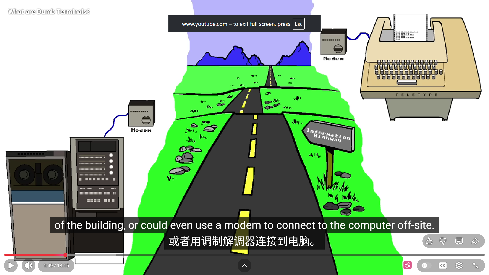

## 从Terminal谈起

### Terminal本身

Terminal(终端)，最早是一种实实在在的硬件设备，它没有计算能力，用来让人和一台远端计算机对话,只负责信息的输入和输出。人们坐在家里使用远程的计算机，那么从第一性原理就可以想到，连接人与计算机之间就需要一种“终端介质”，人类在这里终止输入，系统在这里终止输出。



#### TTY

最早的 terminal 甚至没有屏幕。它是一种 [电传打字机](https://en.wikipedia.org/wiki/Teleprinter)(TeleTYpewriter)，这玩意最早可以追溯到二战使用的电报。随着20世纪50年代早期计算机的发展，电传打字机就被改装成可以将打字数据发送到远端计算机的一种设备。用户通过键盘，字符通过串口或电话线发给主机，并将结果返回回来打印在纸带上。

#### CRT终端

到这里我们就开始熟悉起来了，也是这个时间段“Terminal”这个词正式成为了一个真正意义上的专有硬件设备：一个阴极管射线显示屏幕，一个键盘，一个通信接口，而显示过程就是ASCII码的字符映射过程。最为代表性的就是 [VT100](https://en.wikipedia.org/wiki/VT100)，几乎定义了当今模拟终端的全部标准。

#### 回到现代 —— 伪终端 PTY

现代操作系统主要通过 伪终端（Pseudoterminal, PTY） 机制来模拟传统的物理终端。随着GUI的普及，笨重的物理 CRT 终端已不再作为标准 I/O 设备，但为了保证向后兼容性，操作系统必须提供一种机制，使基于POSIX标准编写的传统命令行程序能够直接运行在现代桌面和网络环境中。

从架构上看，PTY 本质上是操作系统内核提供的一种双向IPC机制，采用严格的主从（Master-Slave）架构：

+ Slave： 面向传统的 CLI 进程。它模拟了一个标准的字符设备。当运行 Python 或 Bash 时，进程通过从端进行 I/O 操作，无感知其运行在虚拟环境中。

+ Master： 面向现代的终端模拟器进程（Terminal emulator）。它负责捕获现代输入设备(键鼠)的事件，并调用系统的图形接口（GPU等）将接收到的字符流渲染为屏幕像素显示。

在这一架构下，我们需要重新严谨地审视程序的 I/O 流程。通常我们会认为例如 python 的 `print()` 或 C 语言的 `printf()` 最终通过底层的系统调用将数据直接输出至屏幕。这实际上是不对的：现代操作系统中，并不存在直接对屏幕进行字符输出的系统调用。

遵循 Unix “一切皆文件” 的设计哲学，当程序发起底层系统调用（如 sys_write(fd=1, buffer)）时，其目标是文件描述符 1，即标准输出（stdout）。在图形化的终端环境下，该文件描述符实际上被重定向并绑定到了某个 PTY 的从端设备文件上。

类 UNIX 操作系统都会具备 PTY 这个虚拟设备（位于 `/dev/ptmx` 下）和配套的系统调用。例如输入 `tty` 查询本次SSH连接在Linux服务器上的一个编号为5的从端：
```Bash
[root@VM-20-3-opencloudos /]# tty
/dev/pts/5
```

查看当前 Shell 进程的所有文件描述符指向，可知当前的Shell进程所有核心的输入(0:stdin)、输出(1:stdout)、错误输出(2:stderr)等操作，全都绑定在这次 SSH 连接的虚拟终端/dev/pts/5上，当我们通过XShell输入命令时，数据从 0 进来；当使用 print 输出文字时，数据被灌入 1，然后流向了 /dev/pts/5：

```Bash
[root@VM-20-3-opencloudos /]# ls -l /proc/$$/fd
total 0
lrwx------ 1 root root 64 Jan 26 10:07 0 -> /dev/pts/5
lrwx------ 1 root root 64 Jan 26 10:07 1 -> /dev/pts/5
lrwx------ 1 root root 64 Jan 26 10:49 2 -> /dev/pts/5
lrwx------ 1 root root 64 Jan 26 10:49 255 -> /dev/pts/5
```

也可以直接将文本显示在另一个SSH连接的 `/dev/pts/6` 的终端窗口上：
```Bash
[root@VM-20-3-opencloudos /]# echo "Hello from /dev/pts/5" > /dev/pts/6
[root@VM-20-3-opencloudos /]# 
```

```Bash
Hello from /dev/pts/5
```
因此，一次完整且正确的标准 I/O 链路如下：

1. 系统调用层： 应用程序向 stdout 写入数据。

2. 内核转发层： 操作系统内核将数据写入 PTY 从端，数据通过内核缓冲区自动流向 PTY 主端。

3. 应用渲染层： 终端模拟器从 PTY 主端读取文本字节流，解析 ANSI 转义序列，并最终调用图形驱动进行屏幕渲染。

---

而在传统的 Windows 架构中，Shell（cmd.exe）与终端窗口（conhost.exe）是被物理级绑定的：

当内核创建一个控制台应用程序进程时，系统会隐式地为其生成一个 conhost.exe 进程。conhost.exe 既负责底层的输入/输出管理，又直接负责图形界面的像素级渲染。
微软没有提供标准的进程间通信接口，所以第三方终端仿真器也没法捕获 Shell 的原始数据流。

这就导致了在同一个窗口中只能绑定一个单一的、孤立的 Shell 进程。

微软在 Windows 10 (Build 1809) 中对控制台子系统进行了重构，引入了 [ConPTY](https://devblogs.microsoft.com/commandline/windows-command-line-introducing-the-windows-pseudo-console-conpty/) 这个中间层，和类Unix下的PTY设计模式类似，ConPTY 负责接收后台 Shell 的输出，并将其翻译成标准的 VT 转义序列。这样，任何终端模拟器都可以直接读取这些标准文本流，而无需关心后台运行的究竟是什么。

这样，我们就可以在一个Terminal中实现cmd，powershell，WSL等多种终端接口共存了：

```Plaintext
[ Terminal.exe ] (UI 渲染和键盘捕获)
    │
    ├─ Tab 1 ── [ConPTY 管道] ──> 子进程 [ cmd.exe ] (Win32 子系统)
    │
    ├─ Tab 2 ── [ConPTY 管道] ──> 子进程 [ powershell.exe ] (.NET Core 运行时)
    │
    └─ Tab 3 ── [ConPTY 管道] ──> 跨系统桥梁 [ wsl.exe ] ──> [ Linux 内核 & Bash ]
```

PTY 是软件工程中极具代表性的 **解耦设计**（Decoupling）。它将“业务逻辑”（CLI 进程）与“界面渲染逻辑”（终端模拟器）彻底分离。基于这一机制，传输过程中的数据被严格限制为纯文本字节流，这不仅确保了系统的高效与稳定性，也构成了现代 SSH 远程控制协议的基石：Master设备只通过网络接受纯文本字节流，省去了像素渲染、字体显示、窗口大小等界面显示信息，而这一部分全部由Master设备的终端模拟器和GPU来完成。

#### 终端模拟器 （Terminal Emulator）

> A terminal emulator, or terminal application, is a computer program that emulates a video terminal within another display architecture. Though typically synonymous with a shell or text terminal, the term terminal covers all remote terminals, including graphical interfaces. A terminal emulator inside a graphical user interface is often called a terminal window.

我们常说的Terminal，准确来说是Terminal Emulator，本质上是一个桌面端程序，用来在现代电脑的显示系统里，模拟一台老式的“视频终端”**[^](https://en.wikipedia.org/wiki/Computer_terminal#Dumb_terminals)**。
那么，这种“老式终端”是个啥？一块屏幕，一个键盘，没有图形界面，只显示字符，用来远程连接大型机或服务器。今天的 Terminal 就是在假装/模拟自己是那种设备。嗯，没错，当我们说terminal时实际上这个只是一个应用程序，而他的UI就是那个经典的黑窗口，里面可以进行指令输入和交互，我们在windows上调出的黑窗口就是这个东西，而他里面跑的“服务”，实际上才是所谓的shell。terminal的价值就是人机交互，而命令的解析等操作是不同的shell通过系统调用实现的。

Wiki接着又指出“Though typically synonymous with a shell or text terminal”这句话是在说，terminal emulator和shell实际上是两种不同的东西，而人们在实际中总是将二者联想成一个东西。而最后一句话"A terminal emulator inside a graphical user interface is often called a terminal window."则直接了当的指出，Terminal Emulator/Terminal window均是一种用来跑shell程序的“交互壳子”。

当然，Terminal这个词从广义上来讲可以指代更多，不光光是这个黑窗口：当我们使用VSCode的默认Terminal面板或是通过SSH连接到远程服务器并敲命令时，这些均属于终端模拟器的一种，即原定义中的"the term terminal covers all remote terminals, including graphical interfaces."

比较有代表性的比如微软自家开源的 [Windows Terminal](https://github.com/microsoft/terminal)， Mac官方的 [Terminal app](https://support.apple.com/guide/terminal/what-is-terminal-trmld4c92d55/2.15/mac/26)，Linux下的 [GNOME Terminal](https://help.gnome.org/gnome-terminal/)，还包括类似 [Alacritty](https://alacritty.org/)、[Ghostty](https://ghostty.org/)等知名度非常高的第三方的Terminal。详细Terminal测评可参考 [这个视频](https://b23.tv/UNCbxMx)。

## Shell？Bash？PowerShell？CMD？

Shell即包裹在操作系统内容外层的壳，用户通过Shell命令调用内核的系统服务。

### Bash命令

Bash命令主要分为外部独立程序和Bash 内建命令两部分，大部分常见的命令如 `ls`等是存在于Linux硬盘上（`/bin`）用 C 语言等写好的独立二进制软件。通过 `$PATH` 环境变量，去硬盘上找到了 `/bin/ls` 这个文件，然后操作系统内核运行对应的逻辑。
而 类似 `cd` 等命令是 Bash 源码自带的函数。我们可以使用 `type` 查看某个命令到底属于哪一类：

```Bash
[root@VM-20-3-opencloudos bin]# type cd
cd is a shell builtin

[root@VM-20-3-opencloudos bin]# type if
if is a shell keyword

[root@VM-20-3-opencloudos bin]# type ls
ls is aliased to `ls --color=auto'

```

除此之外，Bash还是一门极其强大的脚本语言，Bash 内置了 if...else、for 循环、while 循环等完整的语法。将其与和外部的 ls、grep 结合在一起写进一个 .sh 文件时，就可以写 Bash 自动化脚本了。

### CMD PowerShell

cmd.exe的灵魂停留在 1980 年代的 MS-DOS 时期，本质上是一个非常简陋的文本解释器。为了让几十年前的祖传 .bat 批处理文件还能运行而保留了下来。

而PowerShell则是一套全新的自动化运维脚本程序 powershell.exe，和类Unix下的纯文本流相比，管道里不再是字符串，而是 .NET 对象。
与 Bash 类似，PowerShell 里也有内建(Cmdlet)和外包(外部程序)之分：
传统的外部 .exe 依然是独立的程序。PowerShell 也会通过 Windows 的环境变量（Path）去找到并运行它们。这部分和 Linux 一模一样。
PowerShell 的亲儿子 —— Cmdlet，它们不是独立的 .exe 文件。它们是用 C# 语言写好的 .NET 类库，被深度集成在 PowerShell 的进程内部。它们输出的全都是结构化的对象。

和python作为一个脚本语言类似，我们可以使用cmd脚本实现一些简单的功能，比如实现永久禁用windows更新：

```cmd
@echo off
reg add "HKLM\SOFTWARE\Microsoft\WindowsUpdate\UX\Settings" /v PauseFeatureStatus /t REG_DWORD /d 1 /f
reg add "HKLM\SOFTWARE\Microsoft\WindowsUpdate\UX\Settings" /v PauseUpdatesStatus /t REG_DWORD /d 1 /f
reg add "HKLM\SOFTWARE\Microsoft\WindowsUpdate\UX\Settings" /v PauseUpdatesStartTime /t REG_SZ /d "2023-01-01T08:00:00Z" /f
reg add "HKLM\SOFTWARE\Microsoft\WindowsUpdate\UX\Settings" /v PauseUpdatesExpiryTime /t REG_SZ /d "2099-12-31T23:59:59Z" /f
```
保存为 `.bat` 文件后使用管理员运行，将系统更新时间推迟到了2100年。

## 小结

本文总结了一个困扰了我很久的问题，初步探究清楚了到底哪些是壳，哪些是脑子，以及对Linux 下的PTY伪终端概念有了一个初步的认识。

## 参考文章/视频

What are Dumb Terminals?：https://www.youtube.com/watch?v=cRM7mUqLiws

终端的那些“黑魔法”：https://cyandev.app/post/terminal-behind-the-scenes

伪终端（Pseudoterminal）：https://en.wikipedia.org/wiki/Pseudoterminal

Shell：https://en.wikipedia.org/wiki/Shell_(computing)

Computer terminal：https://en.wikipedia.org/wiki/Computer_terminal

ConPTY：https://devblogs.microsoft.com/commandline/windows-command-line-introducing-the-windows-pseudo-console-conpty/

我给每个终端模拟器都排了名次。这太疯狂了：https://b23.tv/UNCbxMx

What is Terminal on Mac?：https://support.apple.com/guide/terminal/what-is-terminal-trmld4c92d55/2.15/mac/26

cmd:https://learn.microsoft.com/en-us/windows-server/administration/windows-commands/cmd

全网最全详解Windows CMD命令大全：Windows CMD 命令小白教程：https://cloud.tencent.com/developer/article/2498695

PowerShell 架构师 Jeffrey Snover：https://en.wikipedia.org/wiki/Jeffrey_Snover

