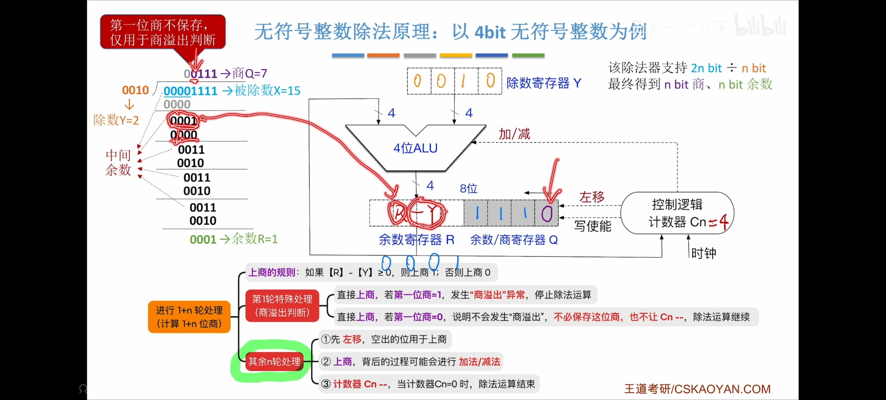
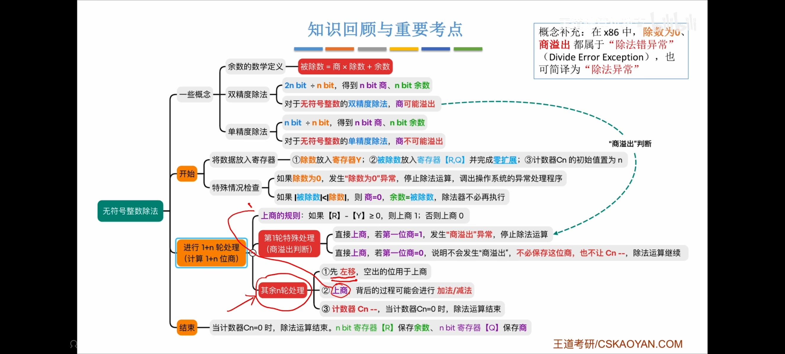

import InlineMath from '../../../components/math/InlineMath.vue'
import Math from '../../../components/math/BlockMath.vue'

## 手算二进制除法

先回忆人类在草稿纸上做二进制除法的竖式流程。核心逻辑很简单：够减写 1，不够减写 0。

举例：算 <InlineMath math={String.raw`15 \div 2`} />。

* 15 的二进制是 `1111`（为了对齐，前面补零扩展成 8 位：`0000 1111`）。

* 2 的二进制是 `0010`。

我们怎么算？除数 `0010` 一步步右移，每次移动后都要比较中间余数：

* 一眼看穿上面比下面大（够减），就在顶上写个 `1`，然后减出真实余数。

* 一眼看穿上面比下面小（不够减），就在顶上写个 `0`，拉下个数字接着比。

人类的优势是能直接比较大小。但在硬件里，这个优势不存在。

## 除法运算的硬件现实

底层 ALU（算术逻辑单元）不会“看大小”，它只会做减法（底层会转成补码加法）。

为适应这个限制，除法机器按下面方式设计：

* 容器扩容（<InlineMath math="2n" /> 位）：乘法会把位宽从 <InlineMath math="n" /> 变成 <InlineMath math="2n" />，除法作为逆运算，也要准备 <InlineMath math="2n" /> 位通路（例如 4 位除法需要 8 位容器）。被除数不够长时，需要在高位补 `0`。

* 双寄存器结构：这个 8 位容器由两个 4 位寄存器组成，左边是 R 寄存器（余数），右边是 Q 寄存器（商）。

* 物理动作：数据进入后整体左移（对应竖式“拉下一位”），逐步生成商。

## 恢复余数法

ALU 无法预判够不够减，所以流程是先减再判断。

1. 左移拉数字：把 Q 的最高位移入 R。

2. 试探减法：ALU 执行 <InlineMath math="R - Y" />（当前余数减去除数）。

3. 根据结果写商：

    + 如果结果非负，商位填 `1`，进入下一轮。

    + 如果结果为负，商位填 `0`。

4. 恢复余数：结果为负时，执行 <InlineMath math="R + Y" /> 恢复现场。

这就是恢复余数法。流程是“试探减法 -> 失败恢复”，会额外消耗时钟周期。

## 4. 加减交替法：数学魔术与负债推延

为减少恢复开销，提出了加减交替法（不恢复余数法）。

工程师们做了一个小学代数推导：
如果当前减法失败（得到 <InlineMath math="R - Y" />），与其“先加 <InlineMath math="Y" /> 恢复、再左移（乘 2）、再减 <InlineMath math="Y" />”（最终得到 <InlineMath math="2R - Y" />），不如直接左移失败结果得到 <InlineMath math="2R - 2Y" />，并在下一轮改做加法 <InlineMath math="+Y" />。

<Math math="(2R - 2Y) + Y = 2R - Y" />

这样可以保持等价。

流程变成：

* 上一步结果为正：商填 `1`。下一轮先左移，再减 <InlineMath math="Y" />。

* 上一步结果为负：商填 `0`。不恢复，直接左移，下一轮改加 <InlineMath math="Y" />。

最后一步是唯一例外：如果最终余数仍为负，没有下一轮可平衡，就必须额外执行一次 <InlineMath math="+Y" />。

## 商溢出

这台机器还有一个限制：保存商的 Q 寄存器只有 <InlineMath math="n" /> 位（例如 4 位最多表示十进制 15）。

例如 <InlineMath math={String.raw`64 \div 2 = 32`} />，结果 32 需要 6 位二进制，无法装进 4 位 Q 寄存器，这就是商溢出（Quotient Overflow），并且如果被除数和除数均是单精度数那么不会溢出，如果除数是双精度数则可能发生溢出。

为避免算到最后才发现溢出，机器在正式移位前会做“第 1 轮检查”：
取被除数最高 <InlineMath math="n" /> 位与除数比较。只要满足 <InlineMath math={String.raw`\text{高 }n\text{ 位} \ge \text{除数}`} />（表示首轮就能减），就说明后续商位数会超过 Q 寄存器，机器立即抛出商溢出异常。

## 知识总结表

